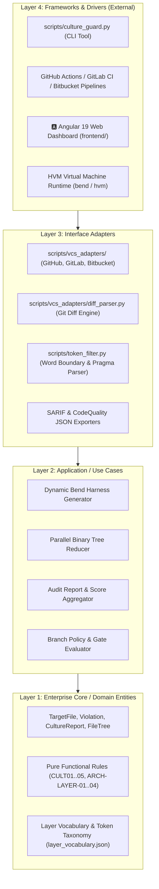
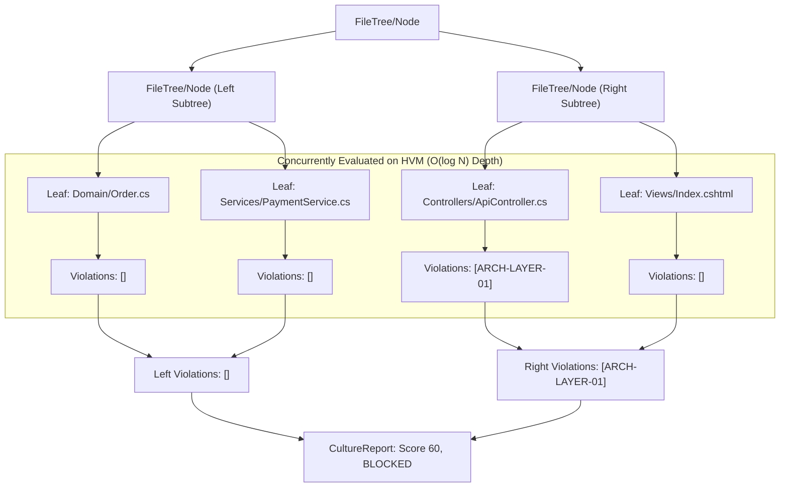
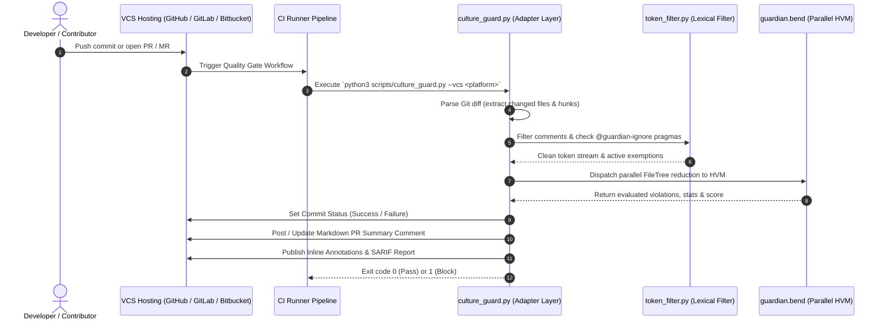

# 🏛️ Architecture & System Design: Bend DevOps Guardian

This document defines the **Clean Architecture**, runtime characteristics, parallel reduction model, and component topology of the **Bend DevOps Guardian** (`bend-devops`).

---

## 🎯 Architectural Vision & Core Principles

The Bend DevOps Guardian is engineered around four core tenets:
1. **Clean Architecture & Separation of Concerns**: Independent of frameworks, databases, or UI. Business rules and architectural invariants reside in the innermost core.
2. **Massive Parallelism via Interaction Combinators**: Purely functional tree reduction executed on the **Bend / HVM** (Higher-Order Virtual Machine) runtime, scaling concurrently across CPU cores and GPU threads.
3. **Spec-Driven Development (SDD) & Traceability**: Bidirectional linking between formal specifications in [`specs/`](./specs/) and implementation artifacts via `@spec RFxx` annotations.
4. **Deterministic Quality Gating**: Side-effect-free audit evaluations producing deterministic scores (0-100) and actionable machine-readable reports.

---

## 🧅 Clean Architecture Layers

The system strictly adheres to Clean Architecture principles organized in concentric rings where dependencies point exclusively inwards:

---

### Layer 1: Enterprise Core & Domain Entities
- **Location**: [`backend/src/guardian.bend`](./backend/src/guardian.bend), [`backend/rules/layer_vocabulary.json`](./backend/rules/layer_vocabulary.json)
- **Responsibilities**:
  - Defines pure algebraic data types (`TargetFile`, `Violation`, `ViolationStats`, `CultureReport`, `FileTree`).
  - Implements inviolable culture and boundary evaluation functions (`check_cult01_lazy_code`, `check_cult02_spec_traceability`, `check_cult03_test_coverage`, `check_cult04_secrets`, `check_cult05_strict_typing`).
  - Completely decoupled from file I/O, network protocols, and external libraries.

### Layer 2: Application / Use Cases
- **Location**: Application workflows within [`backend/src/guardian.bend`](./backend/src/guardian.bend) and [`scripts/culture_guard.py`](./scripts/culture_guard.py)
- **Responsibilities**:
  - `evaluate_tree_parallel(tree)`: Divides the file tree recursively and reduces violation sets concurrently.
  - `generate_audit_report(files_count, violations)`: Calculates penalties, computes normalized quality scores (0-100), and determines gate verdict (`APPROVED` vs `BLOCKED`).
  - `generate_bend_harness(files)`: Synthesizes dynamic evaluation ASTs for execution on HVM.

### Layer 3: Interface Adapters
- **Location**: [`scripts/vcs_adapters/`](./scripts/vcs_adapters/), [`scripts/token_filter.py`](./scripts/token_filter.py)
- **Responsibilities**:
  - **VCS Adapters** ([`BaseVcsAdapter`](./scripts/vcs_adapters/base_adapter.py), [`GitHubAdapter`](./scripts/vcs_adapters/github_adapter.py), [`GitLabAdapter`](./scripts/vcs_adapters/gitlab_adapter.py), [`BitbucketAdapter`](./scripts/vcs_adapters/bitbucket_adapter.py)): Converts external VCS webhook payloads and REST API responses into domain models.
  - **Git Diff Engine** ([`diff_parser.py`](./scripts/vcs_adapters/diff_parser.py)): Extracts modified file lists and altered line numbers from Git patches.
  - **Token & Pragma Filter** ([`token_filter.py`](./scripts/token_filter.py)): Enforces syntactic word boundary fences, comment scoping, and `@guardian-ignore` suppressions.
  - **Presenters & Exporters**: Emits standardized SARIF v2.1.0 documents, GitLab Code Quality JSON, and rich Markdown PR discussion summaries.

### Layer 4: Frameworks & Drivers (Infrastructure)
- **Location**: [`scripts/culture_guard.py`](./scripts/culture_guard.py), [`scripts/validate.sh`](./scripts/validate.sh), [`frontend/`](./frontend/), CI workflows ([`.github/workflows/`](./.github/workflows/), [`.gitlab-ci.yml`](./.gitlab-ci.yml), [`bitbucket-pipelines.yml`](./bitbucket-pipelines.yml))
- **Responsibilities**:
  - CLI argument parsing, environment variable ingestion, and file system traversal.
  - Invoking the Rust-based Bend compiler and HVM runtime.
  - Rendering the Angular 19 reactive Web Dashboard with Tailwind CSS and standalone components.

---

## ⚡ Massively Parallel Reduction Model (Bend & HVM)

The core evaluation uses **Interaction Combinators** in Bend, transforming the codebase audit into a binary tree reduction:

Because Bend execution is purely functional and free of side effects, interaction nodes reduce with **zero lock contention** and **zero Global Interpreter Lock (GIL)** bottlenecks.

---

## 🔄 Multi-Platform VCS Execution Sequence

---

## 🏛️ 4-Tier Declarative Pipeline Architecture

The audit rules are organized into four decoupled stages:
1. [`1_architectures/`](./backend/rules/1_architectures/): Defines structural topologies (`layered_mvc`, `clean_architecture`, `microservices`, `cqrs_event_sourcing`, `rest_api`, `frontend_clean`).
2. [`2_rules/`](./backend/rules/2_rules/): Abstract constraints, severities (`P0_BLOCKING`, `P1_WARNING`), and penalties.
3. [`3_languages/`](./backend/rules/3_languages/): Syntax patterns and AST tokens for C#, Python, TypeScript, PHP, Go, Java, Rust.
4. [`4_scanner/`](./backend/rules/4_scanner/): Engine configurations and quality gate thresholds.

---

## 🔗 Related Documentation
- [Quickstart & CLI Usage](./QUICKSTART.md)
- [4-Tier Pipeline Specification](./PIPELINE.md)
- [Multi-Platform VCS Integrations](./INTEGRATIONS.md)
- [Engineering Standards & Rules Catalog](./RULES.md)
- [Contributor Guidelines](./CONTRIBUTING.md)
