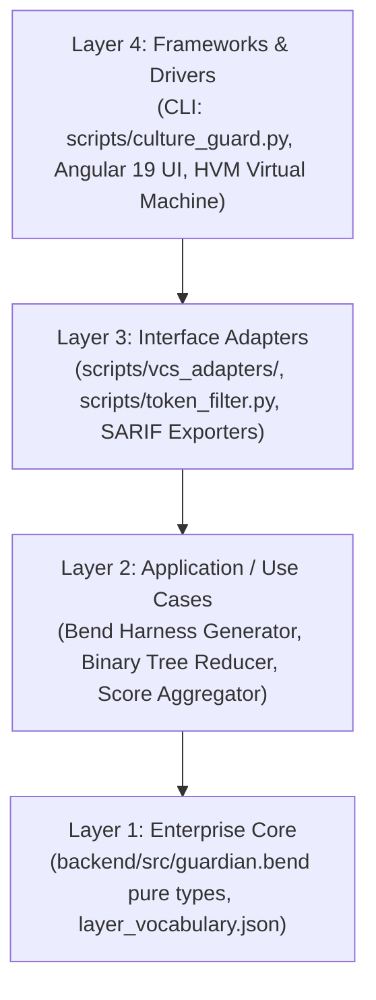

# 🏛️ Architecture & System Design

Clean Architecture structure, parallel HVM reduction model, and component topology for **Bend DevOps Guardian** (`bend-devops`).

---

## 🧅 Clean Architecture Layers

Dependencies point strictly inwards:


```mermaid
flowchart TD
    L4["Layer 4: Frameworks & Drivers\n(CLI: scripts/culture_guard.py, Angular 19 UI, HVM Virtual Machine)"]
    L3["Layer 3: Interface Adapters\n(scripts/vcs_adapters/, scripts/token_filter.py, SARIF Exporters)"]
    L2["Layer 2: Application / Use Cases\n(Bend Harness Generator, Binary Tree Reducer, Score Aggregator)"]
    L1["Layer 1: Enterprise Core\n(backend/src/guardian.bend pure types, layer_vocabulary.json)"]
    L4 --> L3 --> L2 --> L1
```

### Layer Responsibilities

| Layer | Path | Responsibilities |
| :--- | :--- | :--- |
| **Layer 1: Core** | `backend/src/guardian.bend`, `backend/rules/` | Pure algebraic data types (`TargetFile`, `Violation`, `CultureReport`), rules logic, layer taxonomy. |
| **Layer 2: Use Cases** | `backend/src/guardian.bend`, `scripts/culture_guard.py` | Parallel binary tree reduction (`evaluate_tree_parallel`), score calculation, verdict evaluation. |
| **Layer 3: Adapters** | `scripts/vcs_adapters/`, `scripts/token_filter.py` | GitHub/GitLab/Bitbucket adapters, exact token boundary filter, pragma parser, SARIF/JSON exporters. |
| **Layer 4: Drivers** | `scripts/culture_guard.py`, `frontend/`, CI workflows | CLI entrypoint, Angular 19 Web Dashboard, CI/CD pipeline automation. |

---

## ⚡ Bend / HVM Parallel Reduction

Files are mapped into a balanced binary tree evaluated concurrently via interaction combinators on HVM:

```
                  Node (Reduces L + R)
                 /                    \
       Node (L1 + L2)             Node (L3 + L4)
       /            \             /            \
  Leaf(File 1)  Leaf(File 2)  Leaf(File 3)  Leaf(File 4)
```

Time complexity scales logarithmically $O(\log N)$ on multi-threaded CPU/GPU runtimes.
