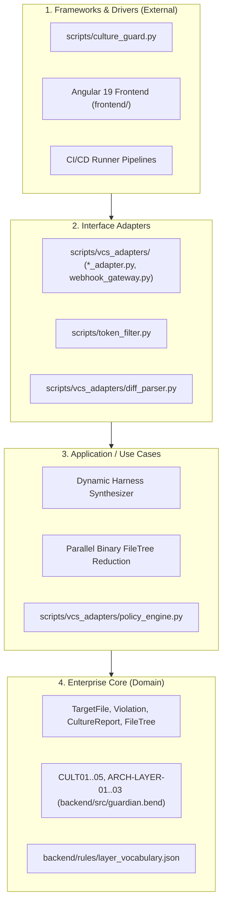

# Clean Architecture & Domain Integrity Audit

**Date**: 2026-09-22  
**Result**: Compliant (Zero Architectural Leaks)

---

## 1. Clean Architecture Layers Audit

---

## 2. Direction of Dependencies Evaluation

| Dependency Path | Direction | Evaluated Files | Verdict | Rationale |
| :--- | :---: | :--- | :---: | :--- |
| **Domain $\rightarrow$ Infrastructure** | ❌ None | `backend/src/guardian.bend` | **PASS** | Domain is written in pure functional Bend with zero I/O, DB, or OS calls. |
| **Domain $\rightarrow$ Framework** | ❌ None | `backend/src/guardian.bend` | **PASS** | Completely framework-agnostic. |
| **Application $\rightarrow$ Domain** | ⬇️ Inward | `guardian.bend` use cases, `policy_engine.py` | **PASS** | Orchestrates domain entities without mutating domain invariants. |
| **Adapters $\rightarrow$ Application** | ⬇️ Inward | `vcs_adapters/`, `token_filter.py` | **PASS** | Transforms external VCS/HTTP payloads into domain entities. |
| **Frameworks $\rightarrow$ Adapters** | ⬇️ Inward | `culture_guard.py`, `frontend/src/app/` | **PASS** | CLI and UI invoke adapters and services via standard interfaces. |

---

## 3. Boundary & Coupling Checklist

- [x] **Zero Presentation Leakage (`ARCH-LAYER-01`)**: Models and Domain entities contain zero HTML tags, JSX markup, client scripts, or styling.
- [x] **Zero Database Leaks in Views (`ARCH-LAYER-02`)**: Presentation templates contain zero direct SQL or ORM queries (`DbContext`, `DB::table`, `objects.filter()`).
- [x] **Zero Transport Coupling in Domain (`ARCH-LAYER-03`)**: Domain models contain zero HTTP request context objects (`HttpContext`, `express.Request`, `$_POST`, `fastapi.Request`).
- [x] **Thin CLI & Controllers**: `culture_guard.py` acts strictly as an orchestrator, delegating parsing to `token_filter.py` and evaluation to Bend HVM.
- [x] **Stateless Parallelism**: Parallel reduction on HVM uses immutable algebraic data types with zero shared mutable state or GIL locks.
