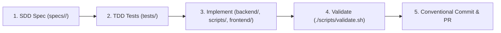

# 🤝 Contributing to Bend DevOps Guardian

Thank you for contributing to **Bend DevOps Guardian** (`bend-devops`)! We follow strict engineering standards, Spec-Driven Development (SDD), and Test-Driven Development (TDD).

---

## 📋 Contribution Workflow



### 1. Spec-Driven Development (SDD)
Before implementing any new feature, rule, or architectural capability:
1. Create or update the formal specification directory in [`specs/`](./specs/).
2. Maintain `spec.md`, `plan.md`, `research.md`, `tasks.md`, `quickstart.md`, `tests.md`, and `contracts/`.
3. Include `@spec RFxx` traceability tags across implementation files.

### 2. Test-Driven Development (TDD)
1. Write failing unit tests first in [`tests/`](./tests/) or [`backend/tests/`](./backend/tests/).
2. Implement the minimum necessary logic to pass the tests.
3. Refactor while keeping all test suites green.

### 3. Running the Validation Gate
All 8 validation stages must pass with exit code 0 before submitting a Pull Request:

```bash
./scripts/validate.sh
```

---

## 📝 Commit Convention

Commit messages must follow the [Conventional Commits](https://www.conventionalcommits.org/) specification:

- `feat(scope)`: New feature or capability
- `fix(scope)`: Bug fix or false-positive correction
- `docs(scope)`: Documentation updates or additions
- `test(scope)`: Adding or updating test suites
- `refactor(scope)`: Code refactoring without behavioral changes
- `chore(scope)`: Tooling, dependencies, or repository maintenance

---

## 🔗 Related Documentation
- [Clean Architecture & System Design](./ARCHITECTURE.md)
- [Quickstart & CLI Usage](./QUICKSTART.md)
- [4-Tier Pipeline Specification](./PIPELINE.md)
- [Multi-Platform VCS Integrations](./INTEGRATIONS.md)
- [Engineering Standards & Rules Catalog](./RULES.md)
