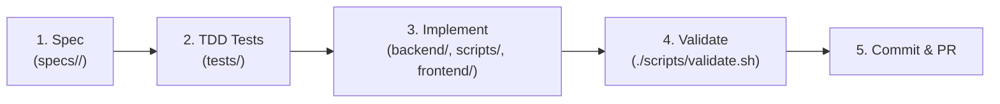

# 🤝 Contributing to Bend DevOps Guardian

Standards for Spec-Driven Development (SDD), Test-Driven Development (TDD), and Pull Requests.

---

## 📋 Workflow

```mermaid
flowchart LR
    S1["1. Spec\n(specs/<demanda>/)"] --> S2["2. TDD Tests\n(tests/)"]
    S2 --> S3["3. Implement\n(backend/, scripts/, frontend/)"]
    S3 --> S4["4. Validate\n(./scripts/validate.sh)"]
    S4 --> S5["5. Commit & PR"]
```

1. **SDD**: Update specification in `specs/` with `@spec RFxx` traceability tags.
2. **TDD**: Write unit tests before implementing changes.
3. **Validation**: Ensure all 8 stages in `./scripts/validate.sh` pass cleanly with exit code 0.

---

## 📝 Commit Standard

Use [Conventional Commits](https://www.conventionalcommits.org/):
- `feat(scope)`: New capability
- `fix(scope)`: Bug fix
- `docs(scope)`: Documentation updates
- `test(scope)`: Test suites
- `refactor(scope)`: Code refactoring
- `chore(scope)`: Tooling/dependencies
