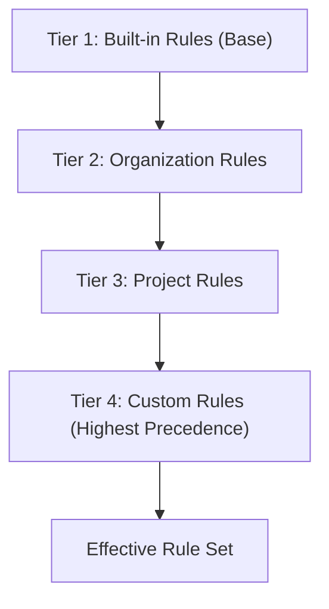
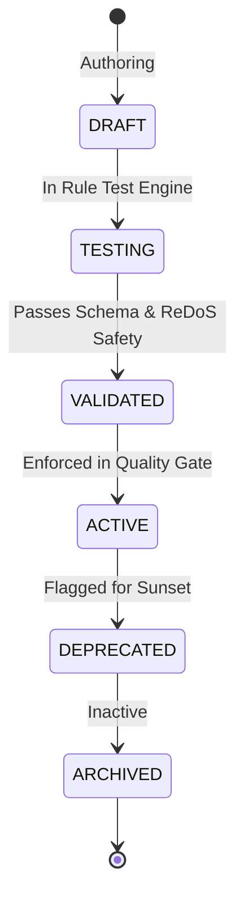

# Extensible Custom Rule Engine Guide

Bend DevOps Guardian provides a fully extensible, multi-tiered declarative rule engine capable of enforcing organizational standards, architectural layer boundaries, naming conventions, dependency constraints, and security standards with parallel evaluation on Bend/HVM.

---

## 1. Multi-Tier Governance & Precedence

Guardian resolves rules deterministically across four hierarchical tiers:



### Precedence Matrix

| Tier | Precedence Rank | Directory Path | Purpose | Override Capability |
| :--- | :---: | :--- | :--- | :--- |
| **Built-in** | 1 (Base) | `backend/rules/builtin/` & `2_rules/` | Core architectural & culture standards | Overridden by Organization, Project, Custom |
| **Organization** | 2 | `backend/rules/organization/` | Enterprise-wide compliance & governance | Overridden by Project, Custom |
| **Project** | 3 | `backend/rules/projects/` | Team/Repository-specific rules | Overridden by Custom |
| **Custom** | 4 (Highest) | `backend/rules/custom/` | Ad-hoc, experimental, or specific overrides | Overrides all lower tiers |

When the same Rule ID (e.g. `ARCH-LAYER-01`) is defined in multiple tiers, Guardian deterministically selects the definition from the highest-ranked tier.

---

## 2. Rule Types

Guardian supports 7 distinct rule evaluation models:

### 2.1 Pattern (`type: "pattern"`)
Evaluates source code using regex patterns with automated ReDoS protection.
```json
{
  "id": "SEC-006",
  "name": "No Hardcoded Credentials",
  "type": "pattern",
  "category": "security",
  "severity": "P0",
  "condition": {
    "pattern": "(password|secret|api_key)\\s*=\\s*['\"][A-Za-z0-9_\\-\\.]{8,}['\"]"
  },
  "message": "Hardcoded credentials detected.",
  "suggestion": "Read credentials from environment variables."
}
```

### 2.2 Naming (`type: "naming"`)
Enforces symbol naming conventions (`PascalCase`, `camelCase`, `snake_case`, `UPPER_CASE`) on classes, interfaces, methods, and functions.
```json
{
  "id": "CULT-NAME-01",
  "name": "PascalCase Classes",
  "type": "naming",
  "category": "culture",
  "severity": "P1",
  "condition": {
    "naming_convention": "PascalCase"
  }
}
```

### 2.3 Dependency (`type: "dependency"`)
Enforces Clean Architecture concentric layer boundaries prohibiting inward layers from importing outward layers.
```json
{
  "id": "ARCH-CLEAN-01",
  "name": "Domain Independence",
  "type": "dependency",
  "category": "architecture",
  "severity": "P0",
  "condition": {
    "source_layer": "Domain",
    "forbidden_targets": ["Infrastructure", "Presentation", "Controllers"]
  }
}
```

### 2.4 Architecture (`type: "architecture"`)
Enforces architectural patterns across layers, services, and subsystems.
```json
{
  "id": "ARCH-LAYER-02",
  "name": "Zero Direct Database in Controllers",
  "type": "architecture",
  "category": "architecture",
  "severity": "P0",
  "condition": {
    "patterns": ["DbContext", "SqlConnection", "EntityManager"]
  }
}
```

### 2.5 File/Folder (`type: "file_folder"`)
Enforces file structure and directory conventions.
```json
{
  "id": "STRUCT-CTRL-01",
  "name": "Controllers Folder Location",
  "type": "file_folder",
  "category": "architecture",
  "severity": "P1",
  "condition": {
    "required_path_prefix": "src/Controllers/"
  }
}
```

### 2.6 AST (`type: "ast"`)
Syntactic structure evaluation using node selectors.

### 2.7 Language-Specific (`type: "language_specific"`)
Targeted rules constrained to specific languages (`csharp`, `python`, `typescript`, `php`, `golang`, `java`, `rust`).

---

## 3. Rule Lifecycle & States



- **DRAFT**: Under construction; excluded from Quality Gate.
- **TESTING**: Being evaluated against unit test fixtures in sandbox.
- **VALIDATED**: Schema-validated and passed safety verification.
- **ACTIVE**: Actively enforced in CI/CD pipelines and PR gating.
- **DEPRECATED**: Emits warnings in Quality Gate without blocking builds.
- **ARCHIVED**: Soft-deleted; retained for audit trail compliance.

---

## 4. Rule Suppressions & `@guardian-ignore`

Guardian enforces mandatory reason documentation for all pragmas. Unjustified suppressions or justifications shorter than 8 characters are rejected as `P1_WARNING` violations.

### Single-line Pragma
```python
# @guardian-ignore SEC-006: Temporary sandbox mock credential for unit test
API_KEY = "mock_sandbox_key_12345"
```

### Block-scoped Pragma
```typescript
// @guardian-ignore-start ARCH-LAYER-01: Legacy migration adapter boundary code
export class LegacyInteropBridge {
  ...
}
// @guardian-ignore-end
```
