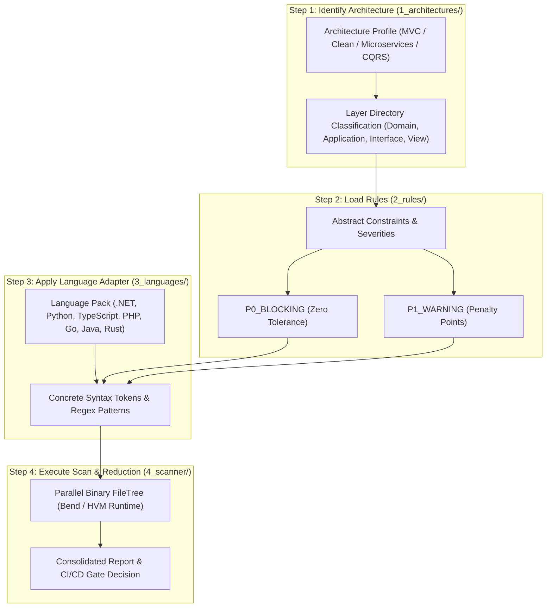

# 🔬 4-Tier Declarative Pipeline & Layer Taxonomy

The **Bend DevOps Guardian** organizes architectural auditing into a 4-tier declarative pipeline that decouples architecture styles, abstract rules, language syntax adapters, and the parallel execution engine.

---

## 4-Step Execution Pipeline

---

## 🏛️ Tier Breakdown

### 1️⃣ Tier 1: Identify Architecture ([`backend/rules/1_architectures/`](./backend/rules/1_architectures/))
Establishes the structural topology, allowed layers, and valid dependency directions:
- [`layered_mvc.json`](./backend/rules/1_architectures/layered_mvc.json) / [`.md`](./backend/rules/1_architectures/layered_mvc.md): Multi-tier MVC (Models, Views, Controllers, Services).
- [`clean_architecture.json`](./backend/rules/1_architectures/clean_architecture.json) / [`.md`](./backend/rules/1_architectures/clean_architecture.md): Concentric layers (Domain, Application, Infrastructure, Presentation).
- [`microservices.json`](./backend/rules/1_architectures/microservices.json) / [`.md`](./backend/rules/1_architectures/microservices.md): Distributed boundaries, database-per-service isolation.
- [`cqrs_event_sourcing.json`](./backend/rules/1_architectures/cqrs_event_sourcing.json) / [`.md`](./backend/rules/1_architectures/cqrs_event_sourcing.md): Command/Query segregation and immutable event streams.
- [`rest_api.json`](./backend/rules/1_architectures/rest_api.json) / [`.md`](./backend/rules/1_architectures/rest_api.md): REST API resource isolation and DTO boundaries.
- [`frontend_clean.json`](./backend/rules/1_architectures/frontend_clean.json) / [`.md`](./backend/rules/1_architectures/frontend_clean.md): UI Component clean architecture (Dumb presentational components vs Smart containers).

---

### 2️⃣ Tier 2: Rules ([`backend/rules/2_rules/`](./backend/rules/2_rules/))
Specifies abstract constraints, rule IDs, severities, and penalty deductions:
- [`layer_boundaries.json`](./backend/rules/2_rules/layer_boundaries.json):
  - `ARCH-LAYER-01`: Zero Presentation Code in Domain, Models & Controllers (P0_BLOCKING).
  - `ARCH-LAYER-02`: Zero Direct Database Queries in Presentation & Views (P0_BLOCKING).
  - `ARCH-LAYER-03`: Zero Transport Protocol Coupling in Domain Models (P0_BLOCKING).
  - `ARCH-LAYER-04`: Thin Controllers (P1_WARNING).
- [`culture_standards.json`](./backend/rules/2_rules/culture_standards.json):
  - `CULT01`: Zero Lazy Code & Complete Implementation (P0_BLOCKING).
  - `CULT02`: Spec Traceability Obligation `@spec RFxx` (P1_WARNING).
  - `CULT03`: Mandatory Automated Test Coverage (P0_BLOCKING).
  - `CULT04`: Zero Hardcoded Secrets and Tokens (P0_BLOCKING).
  - `CULT05`: Strict Typing & Contract Clarity (P1_WARNING).

---

### 3️⃣ Tier 3: Language Adapters ([`backend/rules/3_languages/`](./backend/rules/3_languages/))
Translates abstract rules into concrete syntax and AST tokens:
- [`csharp.json`](./backend/rules/3_languages/csharp.json): C#, Razor, `Microsoft.AspNetCore.Mvc`, `DbContext`, `HttpContext`.
- [`python.json`](./backend/rules/3_languages/python.json): Python 3.10+, Django ORM, FastAPI, Jinja2, Flask `request`.
- [`typescript.json`](./backend/rules/3_languages/typescript.json): TypeScript/JS, React JSX, NestJS, Prisma, Express `Request`.
- [`php.json`](./backend/rules/3_languages/php.json): PHP, Laravel Eloquent, Blade templates, `$_POST`/`$_GET`.
- [`golang.json`](./backend/rules/3_languages/golang.json): Go, Gin context, GORM, `html/template`.
- [`java.json`](./backend/rules/3_languages/java.json): Java, Spring Boot `@Entity`, `@RestController`, JPA, Jakarta `HttpServletRequest`.
- [`rust.json`](./backend/rules/3_languages/rust.json): Rust, Actix-web `HttpRequest`, Axum, Diesel / SQLx.

---

### 4️⃣ Tier 4: Scanner Engine ([`backend/rules/4_scanner/`](./backend/rules/4_scanner/))
- [`scanner_config.json`](./backend/rules/4_scanner/scanner_config.json): Engine settings, default pass score (80), parallel workers, and VCS hook timeouts.
- [`pipeline_definition.md`](./backend/rules/4_scanner/pipeline_definition.md): Pipeline execution specification.

---

## 📚 Layer Vocabulary & Token Taxonomy

The repository includes a comprehensive token and tag taxonomy in [`backend/rules/layer_vocabulary.json`](./backend/rules/layer_vocabulary.json) and [`backend/rules/layer_vocabulary.md`](./backend/rules/layer_vocabulary.md).

| Token Category | Examples / Tags | Forbidden Target Layers |
| :--- | :--- | :--- |
| **Presentation / Markup** | ``, `
`, ``, `<input>`, `<form>`, `<button>`, `<script>`, `<style>`, `document.getElementById` | Domain, Model, Service, Controller |
| **Data Persistence** | `SELECT`, `INSERT`, `UPDATE`, `DELETE`, `DbContext`, `DB::table`, `objects.filter`, `repository.save` | Presentation, View Templates |
| **Transport Protocol** | `HttpContext`, `express.Request`, `$_POST`, `$_GET`, `HttpRequest`, `c.Request()`, `HttpServletRequest` | Domain Entities, Domain Services |
| **Direct Network Calls** | `fetch(`, `axios.get`, `http.get`, `httpClient.post` | Presentational / Dumb UI Components |

---

## 🔗 Related Documentation
- [Clean Architecture & System Design](./ARCHITECTURE.md)
- [Quickstart & CLI Usage](./QUICKSTART.md)
- [Multi-Platform VCS Integrations](./INTEGRATIONS.md)
- [Engineering Standards & Rules Catalog](./RULES.md)
- [Contributor Guidelines](./CONTRIBUTING.md)
