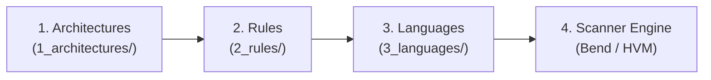

# 🔬 4-Tier Declarative Pipeline & Layer Taxonomy

Declarative pipeline architecture separating profiles, rules, languages, and the parallel execution engine.

---

## Pipeline Overview

```mermaid
flowchart LR
    P1["1. Architectures\n(1_architectures/)"] --> P2["2. Rules\n(2_rules/)"]
    P2 --> P3["3. Languages\n(3_languages/)"]
    P3 --> P4["4. Scanner Engine\n(Bend / HVM)"]
```

---

## Tier Catalog

| Tier | Directory | Scope |
| :--- | :--- | :--- |
| **1. Architectures** | `backend/rules/1_architectures/` | Profiles: `clean_architecture`, `layered_mvc`, `microservices`, `cqrs`, `rest_api`, `frontend_clean`. |
| **2. Rules** | `backend/rules/2_rules/` | Abstract constraints: `CULT01..05`, `ARCH-LAYER-01..05`, `ARCH-SEC-*`. |
| **3. Languages** | `backend/rules/3_languages/` | Language syntax adapters: C#, Python, TypeScript, PHP, Go, Java, Rust. |
| **4. Scanner** | `backend/rules/4_scanner/` | Engine settings, threshold defaults, timeout configurations. |

---

## Layer Boundary Token Matrix

| Category | Sample Tokens | Forbidden Layers |
| :--- | :--- | :--- |
| **Presentation** | ``, `
`, ``, `<form>`, `document.` | Domain, Model, Service, Controller |
| **Persistence** | `SELECT`, `INSERT`, `DbContext`, `DB::table` | Presentation, View Templates |
| **Transport** | `HttpContext`, `express.Request`, `$_POST`, `HttpServletRequest` | Domain Entities, Domain Services |
| **Network** | `fetch(`, `axios.get`, `http.get`, `httpClient.post` | Presentational UI Components |
