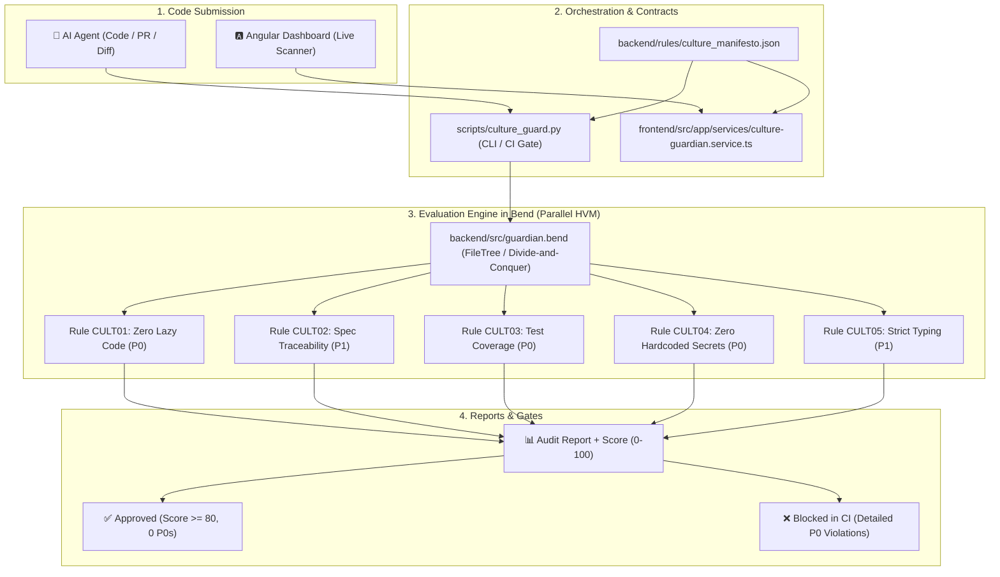

# 🛡️ AI Culture & Standards Guardian (`ai-bend-devops`)

> **The automated right hand of technical leadership for engineering culture and architectural standards in AI Agent-generated code.**
> Built with the purely functional and massively parallel **[Bend](https://github.com/HigherOrderCO/Bend)** (HVM) engine and an interactive **Angular** web dashboard.

---

## 🎯 Overview & Purpose

When multiple AI Agents generate code concurrently, standard deviations, lazy code (`TODOs`, `pass`), missing tests, accidental API secret leaks, and lack of requirements traceability rapidly degrade software architecture.

The **AI Culture Guardian** solves this problem at its root:
- Acts as a **strict quality gate** in CI/CD pipelines and pre-commit hooks.
- Evaluates artifacts and rules using **high-performance parallel binary trees** via Bend/HVM.
- Provides an **Angular Web Dashboard** featuring a real-time Culture Score (0-100), live code auditor, culture rule catalog, and reduction tree simulator.
- Blocks Pull Requests containing `P0_BLOCKING` infractions.
- Operates 100% aligned with the **Spec-Driven Development (SDD)** paradigm.

---

## 🏗️ System Architecture



---

## 📁 Repository Structure

```
ai-bend-devops/
├── frontend/                          # 🅰️ Angular Web Dashboard
│   ├── src/
│   │   ├── app/
│   │   │   ├── models/                # TypeScript models for manifesto & reports
│   │   │   ├── services/              # Audit service and HVM tree builder
│   │   │   ├── app.ts                 # Standalone Component with reactive Signals
│   │   │   ├── app.html               # Dashboard Template
│   │   │   ├── app.css                # Dark theme & styling
│   │   │   └── app.spec.ts            # Unit tests with Vitest
│   │   ├── index.html
│   │   ├── main.ts
│   │   └── styles.css
│   ├── angular.json
│   └── package.json
├── backend/                           # ⚡ Bend Functional Engine & Rules
│   ├── src/
│   │   └── guardian.bend              # Parallel engine in Bend (HVM)
│   ├── tests/
│   │   ├── test_rules.bend            # Rule unit tests in Bend
│   │   └── test_engine.bend           # Parallel engine integration tests
│   └── rules/                         # 🏛️ Architecture & Culture Rule Catalog
│       ├── rules_schema.json          # Meta-Schema for rules
│       ├── culture_manifesto.json     # Core culture rules
│       ├── culture_manifesto.md       # Culture manifesto documentation
│       ├── architecture_laravel_mvc.json # Laravel MVC layer rules
│       ├── architecture_laravel_mvc.md
│       ├── architecture_clean_arch.json # Clean architecture rules
│       ├── architecture_clean_arch.md
│       ├── architecture_microservices.json # Microservices rules
│       ├── architecture_microservices.md
│       ├── architecture_rest_api.json # REST API rules
│       ├── architecture_rest_api.md
│       ├── architecture_frontend_clean.json # Frontend architecture rules
│       ├── architecture_frontend_clean.md
│       ├── architecture_security_zerotrust.json # Zero Trust security rules
│       ├── architecture_security_zerotrust.md
│       ├── architecture_cqrs_event_sourcing.json # CQRS & Event-Driven rules
│       ├── architecture_cqrs_event_sourcing.md
│       └── README.md
├── specs/                             # 📜 Spec-Driven Development (SDD)
│   ├── 001-ai-agent-culture-validator/
│   └── 002-layered-architecture-auditor/
├── scripts/
│   ├── culture_guard.py               # CLI scanner, harness builder, report printer
│   └── validate.sh                    # Universal CI/CD validation script
├── examples/                          # Example codebases (compliant & non-compliant)
│   ├── compliant_agent_output.py
│   ├── test_compliant_agent_output.py
│   └── non_compliant_agent_output.py
├── .github/
│   └── workflows/
│       └── ci.yml                     # Automated GitHub Actions workflow
├── CLAUDE.md                          # Guidelines for AI Coding Agents
└── README.md                          # Main documentation
```

---

## 🚀 Quickstart & Execution

### 1. Universal Validation (Bend + Angular + CLI Gate)
```bash
./scripts/validate.sh
```

### 2. Run the Angular Dashboard Locally
```bash
# From workspace root:
npm run dev

# Or within frontend folder:
cd frontend
npm run dev
# Open http://localhost:4200 in your browser
```

### 3. Run Bend Engine Tests
```bash
# Unit tests
bend run-rs backend/tests/test_rules.bend

# Integration tests
bend run-rs backend/tests/test_engine.bend
```

### 4. Audit Files via CLI
```bash
# Audit compliant code (Approved with score 100)
python3 scripts/culture_guard.py examples/compliant_agent_output.py examples/test_compliant_agent_output.py

# Audit non-compliant code (Blocked with exit code 1)
python3 scripts/culture_guard.py examples/non_compliant_agent_output.py
```
