# 🛡️ Bend DevOps Guardian (`bend-devops`)

> **High-Performance Architecture & Engineering Standards Quality Gate for DevOps CI/CD Pipelines.**
> Built with the purely functional and massively parallel **[Bend](https://github.com/HigherOrderCO/Bend)** (HVM) engine and an interactive **Angular** web dashboard.

---

## 🎯 Overview & Philosophy

In modern high-velocity continuous integration and delivery (CI/CD) environments, rapid code changes, architectural drift, incomplete stubs, missing automated tests, accidental credential leaks, and cross-tier boundary violations can silently compromise software reliability.

The **Bend DevOps Guardian** acts as an uncompromising automated quality gate embedded directly into DevOps workflows:
- **Massively Parallel Reduction**: Analyzes dozens of files and hundreds of rules simultaneously using functional binary tree reductions on the Bend High-Order Virtual Machine (HVM).
- **Multi-Platform CI/CD Gate**: Operates natively in **GitHub Actions**, **GitLab CI/CD**, and **Bitbucket Pipelines**, posting PR/MR comments, inline diff annotations, SARIF reports, and commit status checks.
- **Universal Architecture Taxonomy**: Enforces declarative architectural profiles (Layered MVC, Clean Architecture, Microservices, CQRS, REST APIs, Frontend Clean Architecture) across any tech stack (.NET, Python, TypeScript, PHP, Go, Java, Rust).
- **False-Positive Elimination**: Syntactic word boundary fencing, comment scoping, and inline documented suppression pragmas (`@guardian-ignore`).
- **Interactive DevOps Dashboard**: Visualizes pipeline compliance metrics, rules catalog, and real-time pull request diff simulations.

---

## 🏗️ System Architecture

```mermaid
flowchart TD
    subgraph Ingress ["1. Continuous Integration Triggers"]
        PR["Pull Request / Merge Request (GitHub, GitLab, Bitbucket)"]
        CLI_Runner["DevOps CLI / Pre-commit Hook"]
        WebUI["🅰️ Angular DevOps Dashboard"]
    end

    subgraph Pipeline ["2. 4-Tier Evaluation Pipeline"]
        S1["1_architectures/ (Topologies & Layer Hierarchies)"]
        S2["2_rules/ (Layer Boundaries & Engineering Standards)"]
        S3["3_languages/ & layer_vocabulary.json (Token Taxonomy)"]
        S4["4_scanner/ & token_filter.py (Word Boundary & Scoping)"]
    end

    subgraph Engine ["3. Massively Parallel HVM Reduction"]
        Tree["backend/src/guardian.bend (Binary FileTree Evaluator)"]
        R1["Rule CULT01: Zero Incomplete Code (P0)"]
        R2["Rule CULT02: Spec Traceability (P1)"]
        R3["Rule CULT03: Mandatory Automated Tests (P0)"]
        R4["Rule CULT04: Zero Hardcoded Secrets (P0)"]
        R5["Rule CULT05: Strict Typing Contracts (P1)"]
        R6["Rule ARCH-LAYER-01..04: Layer Boundaries (P0)"]
    end

    subgraph Egress ["4. DevOps Gate Artifacts & Telemetry"]
        StatusCheck["Commit Status Check (Success / Failure)"]
        PRNotes["PR / MR Inline Annotations & Discussion Summary"]
        SARIF["SARIF v2.1.0 & GitLab CodeQuality JSON"]
        DashboardTelemetry["DevOps Telemetry & Score (0-100)"]
    end

    Ingress --> Pipeline
    Pipeline --> Engine
    Engine --> Egress
```



---

## 📁 Repository Structure

```
bend-devops/
├── backend/
│   ├── rules/                         # 🏛️ 4-Tier Declarative Catalog & Vocabulary
│   │   ├── 1_architectures/           # Architecture Profiles (MVC, Clean, Microservices, CQRS)
│   │   ├── 2_rules/                   # Abstract Boundary & Culture Rules
│   │   ├── 3_languages/               # Language Syntax & AST Adapters (C#, Py, TS, PHP, Go, Java, Rust)
│   │   ├── 4_scanner/                 # Scanner & Engine Configurations
│   │   ├── layer_vocabulary.json      # Complete Word, Tag & Token Taxonomy
│   │   ├── layer_vocabulary.md        # Comprehensive Layer Taxonomy Guide
│   │   └── rules_schema.json          # JSON Schema validating all manifests
│   ├── src/
│   │   └── guardian.bend              # Pure functional parallel AST tree evaluator
│   └── tests/
│       ├── test_rules.bend            # Rule engine functional unit tests
│       └── test_engine.bend           # Parallel tree reduction integration tests
├── scripts/
│   ├── culture_guard.py               # Universal CLI auditor & CI/CD gate orchestrator
│   ├── token_filter.py                # Syntactic boundary filter & pragma parser
│   ├── validate.sh                    # 8-stage end-to-end quality gate script
│   └── vcs_adapters/                  # GitHub, GitLab, and Bitbucket platform adapters
├── specs/                             # 📋 Spec-Driven Development (SDD) Specifications
│   ├── 001-devops-standards-validator/# Core Parallel HVM Engine Spec
│   ├── 002-layered-architecture-auditor/# 4-Tier Pipeline & Layer Vocabulary Spec
│   ├── 003-vcs-git-platforms-integration/# GitHub, GitLab, Bitbucket Integration Spec
│   └── 004-false-positive-suppression-engine/# False-Positive Elimination & Pragmas Spec
├── tests/                             # 🧪 Automated Python TDD Test Suite
│   ├── test_token_filter.py           # Token boundary tests
│   ├── test_suppressions.py           # Inline pragma tests
│   ├── test_false_positives.py        # False-positive scenario integration tests
│   └── vcs/                           # Multi-platform VCS adapter unit tests
├── frontend/                          # 🅰️ Angular 19 DevOps Quality Dashboard
│   ├── src/app/                       # Standalone Components, Models & Reactive Signals
│   └── package.json                   # Angular and Tailwind CSS dependencies
├── .github/workflows/guardian.yml     # GitHub Actions Quality Gate Workflow
├── .gitlab-ci.yml                     # GitLab CI/CD Quality Gate Pipeline
└── bitbucket-pipelines.yml            # Bitbucket Pipelines Quality Gate Configuration
```

---

## ⚡ Quickstart & Execution

### 1. Prerequisites
- [Bend](https://github.com/HigherOrderCO/Bend) (`cargo install bend-lang`)
- Python 3.10+
- Node.js 20+ & npm (for Angular Dashboard)

### 2. Run End-to-End Quality Gate
```bash
./scripts/validate.sh
```

### 3. CLI Audit in DevOps Pipelines
```bash
# Run audit on codebase
python3 scripts/culture_guard.py src/

# Run in CI/CD mode with automated VCS status reporting
python3 scripts/culture_guard.py --vcs github

# Export JSON report
python3 scripts/culture_guard.py src/ --format json
```

### 4. Launch Angular Dashboard
```bash
cd frontend
npm install
npm start
# Open http://localhost:4200
```
