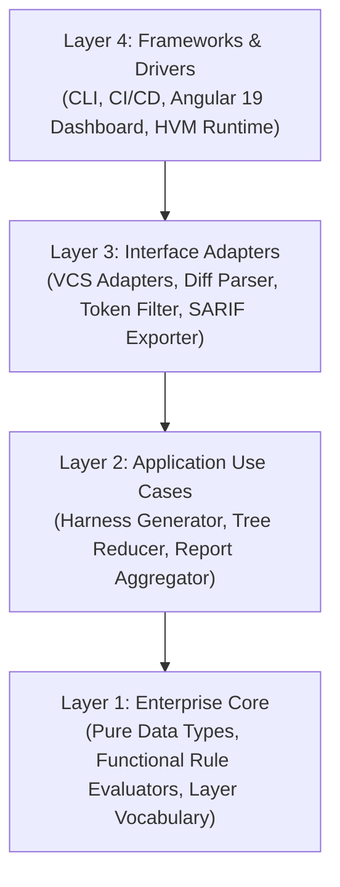

# 🛡️ Bend DevOps Guardian (`bend-devops`)

Quality gate and architecture compliance engine for CI/CD pipelines. Evaluates code standards and layer boundaries using parallel reduction on **[Bend](https://github.com/HigherOrderCO/Bend)** (HVM) with an **Angular 19** web dashboard.

---

## 🧭 Documentation Index

| Guide | Description |
| :--- | :--- |
| 📖 **[`USAGE.md`](./USAGE.md)** | Complete CLI flags, rule operations, UI walkthrough, CI/CD setup, and recipes. |
| 🏛️ **[`ARCHITECTURE.md`](./ARCHITECTURE.md)** | Clean Architecture layers, Bend parallel HVM reduction, and system topology. |
| 📜 **[`RULES.md`](./RULES.md)** | Complete rules catalog (`CULT01..05`, `ARCH-*`), severities, and `@guardian-ignore` pragmas. |
| 🛡️ **[`CUSTOM-RULES.md`](./CUSTOM-RULES.md)** | Multi-tier precedence, custom rule JSON schema, ReDoS safety, and test fixtures. |
| 🔌 **[`RULE-API.md`](./RULE-API.md)** | REST API endpoints for rule CRUD, testing, cloning, and audit trails. |
| 🌐 **[`INTEGRATIONS.md`](./INTEGRATIONS.md)** | CI/CD configurations for GitHub Actions, GitLab CI/CD, and Bitbucket Pipelines. |
| 🔬 **[`PIPELINE.md`](./PIPELINE.md)** | 4-Tier Declarative Pipeline and layer vocabulary taxonomy. |
| 🤝 **[`CONTRIBUTING.md`](./CONTRIBUTING.md)** | Spec-Driven Development (SDD), TDD testing, and commit conventions. |

---

## ⚡ Core Features

- **Massively Parallel Engine**: Evaluates files and rules concurrently via functional binary tree reductions on Bend HVM.
- **Architecture Enforcement**: Validates layer boundaries for Clean Architecture, Layered MVC, Microservices, CQRS, and Frontend.
- **Zero False-Positives**: Exact token boundary fences, comment scoping, and documented inline pragmas (`@guardian-ignore`).
- **CI/CD Quality Gate**: Enforces branch policies, posts PR comments, generates SARIF v2.1.0 and Code Quality JSON.
- **Interactive Dashboard**: Angular 19 SPA with live diff viewer, rule sandbox, and architecture visualizer.

---

## 🧅 System Architecture


```mermaid
flowchart TD
    L4["Layer 4: Frameworks & Drivers\n(CLI, CI/CD, Angular 19 Dashboard, HVM Runtime)"]
    L3["Layer 3: Interface Adapters\n(VCS Adapters, Diff Parser, Token Filter, SARIF Exporter)"]
    L2["Layer 2: Application Use Cases\n(Harness Generator, Tree Reducer, Report Aggregator)"]
    L1["Layer 1: Enterprise Core\n(Pure Data Types, Functional Rule Evaluators, Layer Vocabulary)"]
    L4 --> L3 --> L2 --> L1
```

---

## 📁 Repository Structure

```text
bend-devops/
├── backend/
│   ├── rules/            # Declarative architecture profiles, rules, languages, vocabularies
│   ├── src/              # Pure functional AST evaluator (guardian.bend)
│   └── tests/            # Bend unit and integration tests
├── frontend/             # Angular 19 Web Dashboard (Standalone, Signals, Vitest)
├── scripts/              # CLI runner (culture_guard.py), server (guardian_server.py), VCS adapters
├── specs/                # Spec-Driven Development (SDD) specifications
└── tests/                # Python TDD test suites (VCS, token filters, suppressions)
```

---

## 🚀 Quick Start

### Prerequisites
- **Rust & Bend**: `cargo install bend-lang hvm`
- **Python**: `3.10+`
- **Node.js**: `20+`

### Commands
```bash
# 1. Run complete 8-stage validation suite
./scripts/validate.sh

# 2. Audit codebase via CLI
python3 scripts/culture_guard.py src/ --architecture clean_architecture

# 3. Manage rules via CLI
python3 scripts/culture_guard.py rules list --active-only
python3 scripts/culture_guard.py rules test CULT01 --code "def fn(): pass"

# 4. Start Unified Server & Dashboard UI
python3 scripts/guardian_server.py --port 4200
```
