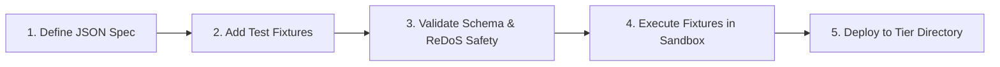

# Rule Authoring Guide

This guide provides step-by-step instructions for authoring, validating, testing, and activating custom rules in **Bend DevOps Guardian**.

---

## 1. Step-by-Step Rule Authoring Workflow



---

## 2. Rule Schema Structure

Every rule file must conform to `backend/rules/rules_schema.json`:

```json
{
  "id": "SEC-CUSTOM-001",
  "version": "1.0.0",
  "name": "No Plaintext Password Assignments",
  "description": "Prevents plaintext password assignment in source code files.",
  "type": "pattern",
  "category": "security",
  "severity": "P0",
  "penaltyPoints": 35,
  "status": "ACTIVE",
  "enabled": true,
  "tier": "custom",
  "languages": ["python", "typescript", "csharp"],
  "architectures": ["clean_architecture", "layered_mvc"],
  "scope": {
    "include": ["src/**", "app/**"],
    "exclude": ["tests/**", "fixtures/**"]
  },
  "condition": {
    "pattern": "(password|pwd|secret)\\s*=\\s*['\"][A-Za-z0-9_\\-\\.\\@\\#\\$]{6,}['\"]"
  },
  "message": "Potential hardcoded plaintext credential detected.",
  "suggestion": "Extract credential to environment variables or Azure KeyVault / AWS Secrets Manager.",
  "rationale": "Hardcoded credentials in VCS expose systems to credential stuffing and leakage.",
  "remediation": "Use os.environ.get('KEY') or IConfiguration in .NET.",
  "suppression": {
    "allowed": true,
    "pragma": "@guardian-ignore",
    "requires_reason": true,
    "minimum_reason_length": 8
  },
  "tests": [
    {
      "name": "Detects plaintext DB password",
      "input": "password = \"my_secret_pass_123!\"",
      "expected_violation": true,
      "expected_line": 1
    },
    {
      "name": "Passes environment variable reading",
      "input": "password = os.environ.get(\"DB_PASSWORD\")",
      "expected_violation": false
    }
  ]
}
```

---

## 3. ReDoS Safety Guidelines

To protect the CI/CD pipeline from catastrophic regex backtracking:

1. **Avoid Nested Quantifiers**: Never use `(a+)+`, `(\w+)+`, `(\.*)+`, or `(a*)*`.
2. **Anchor Patterns where possible**: Use `^` or `\b` word boundaries.
3. **Use Character Classes**: Prefer `[^'"]+` over `.*` inside quotes.
4. **Benchmark Testing**: Test your patterns with 100+ character synthetic strings.

Guardian automatically tests all regexes against adversarial synthetic inputs during validation.

---

## 4. Testing Rules with the CLI

### Validate Schema and Safety
```bash
python3 scripts/culture_guard.py rules validate backend/rules/custom/sec-custom-001.json
```

### Run Isolated Test Against Source Code
```bash
python3 scripts/culture_guard.py rules test SEC-CUSTOM-001 --code "password = 'admin123456'"
```

### Run Fixture Suite
```bash
python3 scripts/culture_guard.py rules test backend/rules/custom/sec-custom-001.json
```

---

## 5. Adding Rule Test Fixtures

Save fixture files under `tests/rules/<RULE_ID>/`:

```text
tests/rules/
└── SEC-CUSTOM-001/
    ├── valid/
    │   └── safe_auth_service.py
    └── invalid/
        └── leaked_password.py
```
