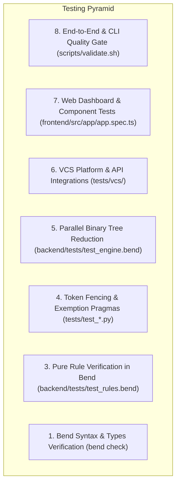

# Test Strategy & Testability Scan: Bend DevOps Guardian

**Date**: 2026-09-22  
**Status**: 100% Operational

---

## 1. Test Strategy Overview

The testing strategy follows the **Testing Pyramid** with strict separation of concerns across functional tiers:

---

## 2. Component Testability Matrix

| Component | Isolated | Deterministic | Mockable | State Type | Testability Classification |
| :--- | :---: | :---: | :---: | :--- | :--- |
| `backend/src/guardian.bend` | ✅ | ✅ | N/A | Pure Functional | **TESTABLE (100% Pure)** |
| `backend/tests/test_rules.bend` | ✅ | ✅ | N/A | Pure Functional | **TESTABLE (100% Pure)** |
| `backend/tests/test_engine.bend`| ✅ | ✅ | N/A | Pure Functional | **TESTABLE (100% Pure)** |
| `scripts/token_filter.py` | ✅ | ✅ | ✅ | Stateless Static | **TESTABLE** |
| `scripts/vcs_adapters/diff_parser.py` | ✅ | ✅ | ✅ | Stateless Pure | **TESTABLE** |
| `scripts/vcs_adapters/policy_engine.py` | ✅ | ✅ | ✅ | Configurable | **TESTABLE** |
| `scripts/vcs_adapters/webhook_gateway.py` | ✅ | ✅ | ✅ | Stateless Pure | **TESTABLE** |
| `scripts/vcs_adapters/*_adapter.py` | ✅ | ✅ | ✅ (HTTP mocks) | Adapter Layer | **TESTABLE** |
| `scripts/culture_guard.py` | ✅ | ✅ | ✅ (CLI / File IO)| Orchestrator | **TESTABLE** |
| `frontend/src/app/app.ts` | ✅ | ✅ | ✅ (Service DI) | Angular Signal | **TESTABLE** |
| `frontend/src/app/services/` | ✅ | ✅ | ✅ (Mock Presets)| Service State | **TESTABLE** |

---

## 3. Feature-to-Test Mapping

| Feature ID | Feature Name | Unit Tests | Integration Tests | API / Contract Tests | E2E Tests | Security Checks |
| :--- | :--- | :---: | :---: | :---: | :---: | :---: |
| **FEAT-001..004** | Bend Core & Reduction | `test_rules.bend` | `test_engine.bend` | N/A | `validate.sh [5/8]` | Stateless |
| **FEAT-005..009** | Layer Boundaries & Token Matrix | `test_token_filter.py` | `test_false_positives.py` | N/A | `validate.sh [8/8]` | Leak prevention |
| **FEAT-010** | Multi-Language Adapters | `test_token_filter.py` | `test_false_positives.py` | JSON Schema | `validate.sh [6/8]` | Syntax fence |
| **FEAT-011..014** | Angular 19 UI & Diffs | `app.spec.ts` | `app.spec.ts` | Model Contracts | `validate.sh [4/8]` | UI isolation |
| **FEAT-015** | Diff & Hunk Line Parser | `test_diff_parser.py` | `test_diff_parser.py` | N/A | `validate.sh [7/8]` | Safe parsing |
| **FEAT-016** | GitHub Adapter & SARIF | `test_github_adapter.py` | `test_github_adapter.py` | SARIF v2.1.0 | `validate.sh [7/8]` | Redaction |
| **FEAT-017** | GitLab Adapter & CodeQuality | `test_gitlab_adapter.py` | `test_gitlab_adapter.py` | GL Report JSON | `validate.sh [7/8]` | Redaction |
| **FEAT-018** | Bitbucket Adapter & Insights | `test_bitbucket_adapter.py`| `test_bitbucket_adapter.py`| Code Insights | `validate.sh [7/8]` | Redaction |
| **FEAT-019** | Unified Webhook Gateway | `test_webhook_gateway.py` | `test_webhook_gateway.py` | Webhook JSON | `validate.sh [7/8]` | Payload valid |
| **FEAT-020** | Branch Policy Engine | `test_policy_engine.py` | `test_policy_engine.py` | Gate Thresholds| `validate.sh [7/8]` | Strict gates |
| **FEAT-022..027** | Token Filter & Pragmas | `test_token_filter.py` | `test_suppressions.py` | `.guardianignore` | `validate.sh [6/8]` | Pragma checks |
| **FEAT-029** | 8-Stage Validation Pipeline | All unit tests | All integration tests | All contracts | `validate.sh [1..8]` | Exit 0/1 gate |
