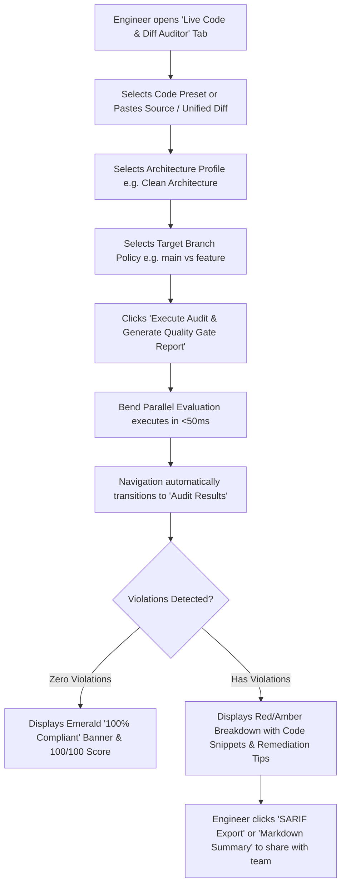
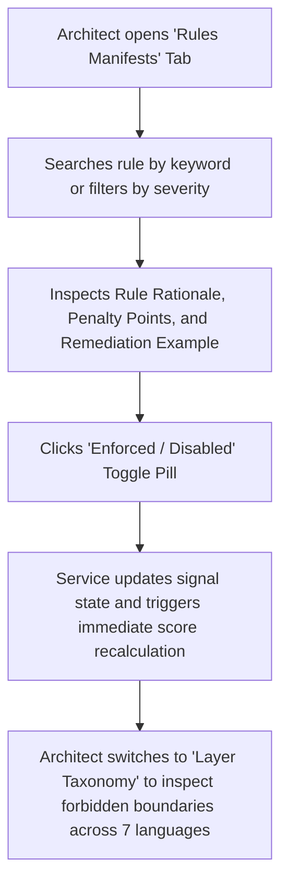
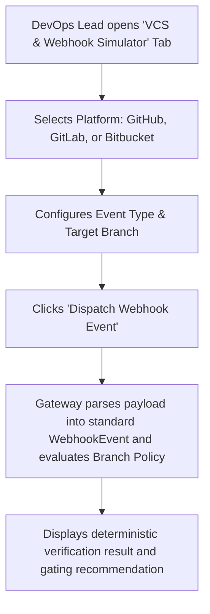

# UX_FLOW_MAP.md: User Journeys & Interaction Flow Maps

**Project**: Bend DevOps Guardian (CodeConform Dashboard)  
**Audit Date**: 2026-09-22  
**Design System**: shadcn/ui Developer Theme with Dark Slate Palette  

---

## 1. Primary User Journeys

### Journey 1: Live Code Quality & Architecture Audit

### Journey 2: Rules Catalog & Taxonomy Exploration

### Journey 3: Multi-Platform VCS & Webhook Simulation

---

## 2. UX States Enforced Across Views

- **Initial State**: Clean, readable default inputs with pre-configured compliant/non-compliant presets.
- **Loading / Busy State**: Smooth signal transitions without layout shifting.
- **Success State**: Emerald badge pills, high-contrast compliance scores, and clear pass indicators.
- **Error / Blocked State**: High-visibility rose alerts, clear violation explanations, line numbers, and copyable remediation guidance.
- **Empty State**: Contextual explanations with clear call-to-action buttons.
- **Accessibility & Responsiveness**: Semantic HTML5 tags, ARIA labels, full keyboard focus support, and mobile/tablet collapsible layouts.
