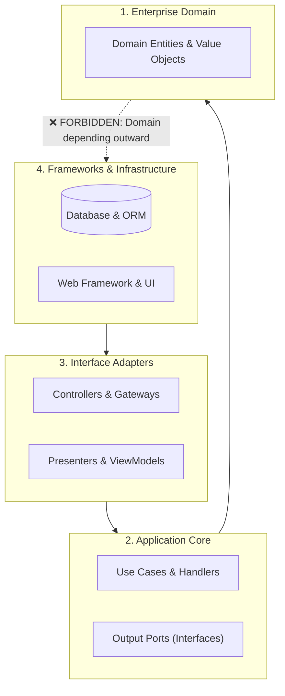

# Architecture Profile: Clean & Hexagonal Architecture

---

## 1. Concentric Dependency Boundaries

---

## 2. Invariant Rules
- **Dependency Rule**: Code dependencies point exclusively inward towards the Domain.
- **Port Inversion**: Infrastructure implements interfaces (Ports) declared in Application/Domain.
