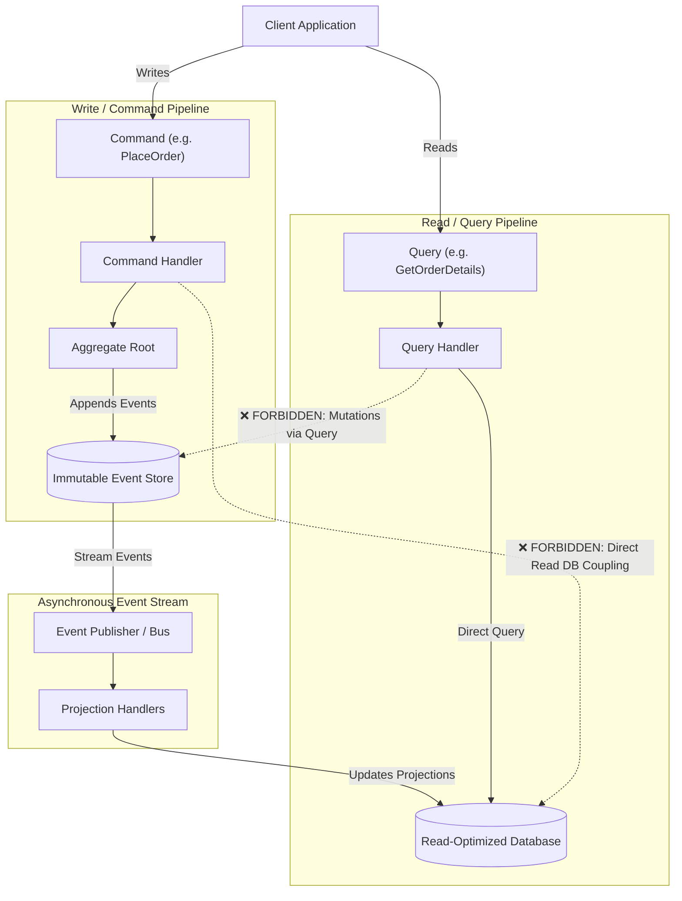

# Architecture Profile: CQRS & Event Sourcing

This document formalizes the **CQRS & Event Sourcing Architecture Profile** within the 4-step pipeline:
`1. Architecture ➔ 2. Rules ➔ 3. Language ➔ 4. Scan`.

---

## 1. Architectural Topology: Command & Query Segregation

---

## 2. Invariant Architectural Constraints

1. **Immutable Event Ledger**: Events appended to the Event Store must be strictly immutable and append-only.
2. **Side-Effect-Free Queries**: Query handlers must never mutate state or publish domain events.
3. **Optimistic Concurrency**: Aggregates must use expected version numbers to prevent conflicting concurrent writes.
