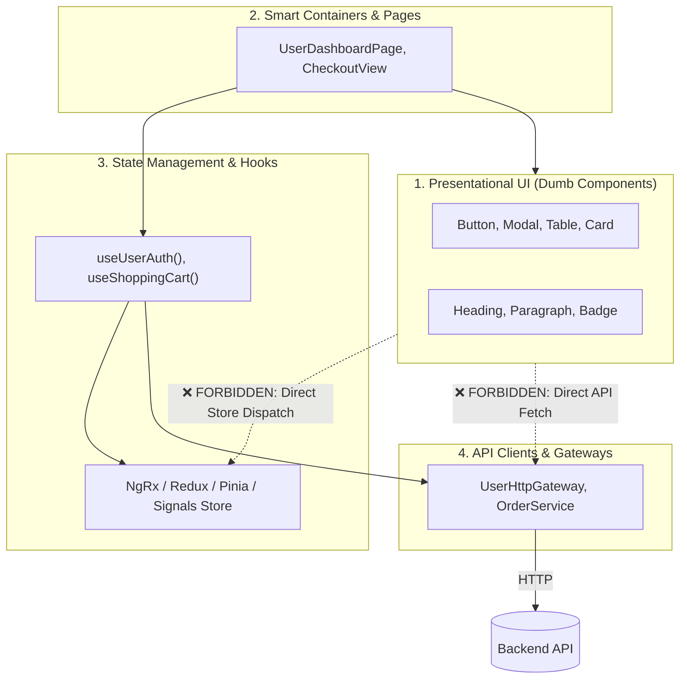

# Architecture Profile: Frontend Clean Architecture

This document formalizes the **Frontend Clean Architecture Profile** within the 4-step pipeline:
`1. Architecture ➔ 2. Rules ➔ 3. Language ➔ 4. Scan`.

---

## 1. Architectural Topology: Component Tiering

---

## 2. Invariant Architectural Constraints

1. **Pure Presentational Components**: UI components under `components/ui/` must receive data via props/inputs and emit events via callbacks; zero direct API calls.
2. **Encapsulated Network Calls**: API calls must be wrapped in gateway services or custom hooks.
3. **Immutable State**: State mutations must be immutable.
