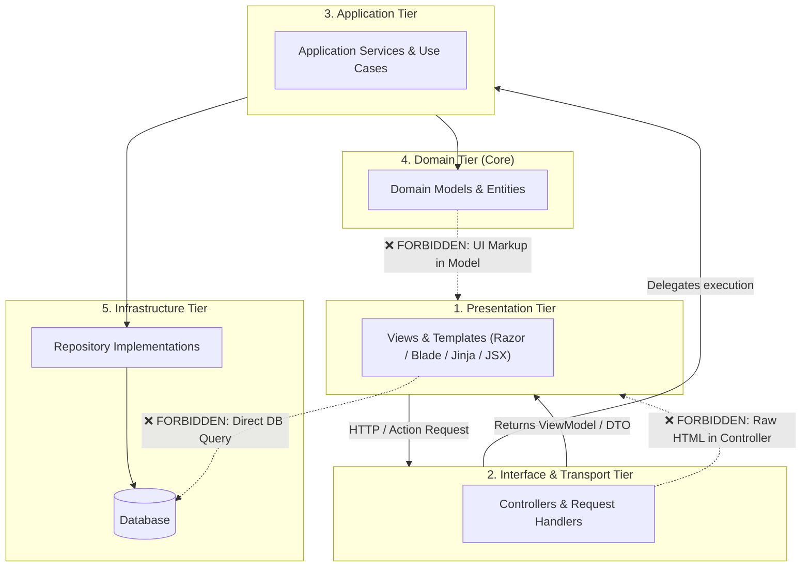

# Architecture Profile: Layered & MVC Architecture

This document formalizes the **Layered & MVC Architecture Profile** within the 4-step pipeline:
`1. Architecture ➔ 2. Rules ➔ 3. Language ➔ 4. Scan`.

---

## 1. Architectural Layers & Topologies

---

## 2. Invariant Layer Constraints

1. **Presentation Isolation**: UI templates must only render data received via ViewModels/DTOs; direct DB calls are prohibited.
2. **Domain Purity**: Domain models must never contain HTML, client scripts, or transport context (`HttpContext`, `request()`).
3. **Thin Controllers**: Controllers orchestrate input/output without holding business logic.
