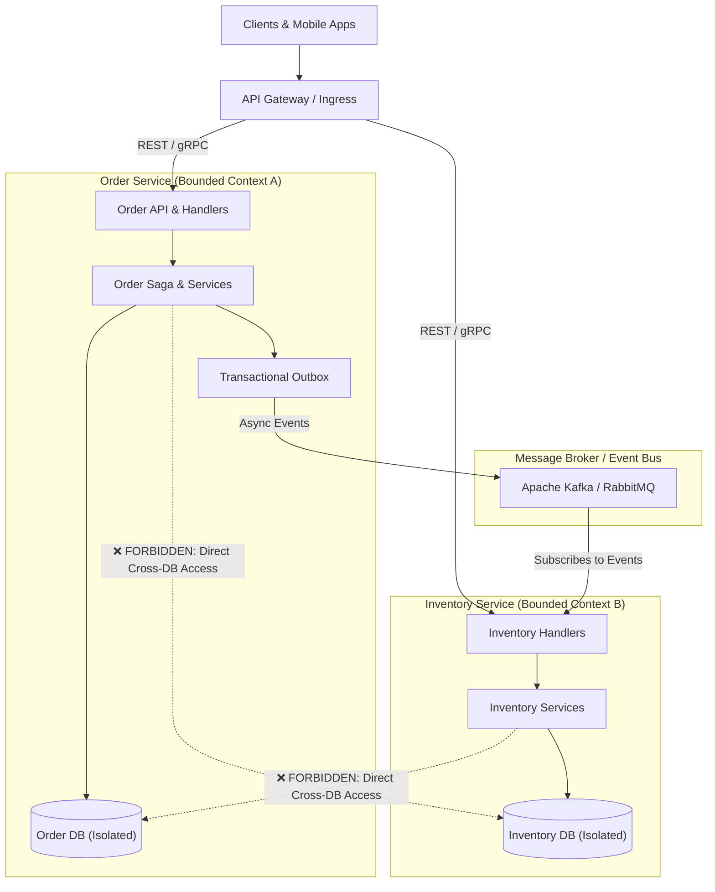

# Architecture Profile: Microservices & Distributed Systems

This document formalizes the **Microservices Architecture Profile** within the 4-step pipeline:
`1. Architecture ➔ 2. Rules ➔ 3. Language ➔ 4. Scan`.

---

## 1. Architectural Topology & Service Boundaries

---

## 2. Invariant Architectural Constraints

1. **Database-per-Service**: Services must never directly query or mutate another service's private database.
2. **Resilient Inter-Service Communication**: All synchronous inter-service calls must enforce strict timeouts, retries with exponential backoff, and circuit breakers.
3. **Dual-Write Consistency**: State mutations and associated published events must use the Transactional Outbox pattern or Saga orchestrators.
4. **Idempotent Message Processing**: Consumers must handle at-least-once message delivery without state corruption.
