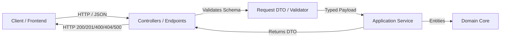

# Architecture Profile: REST API Standards

This document formalizes the **REST API Profile** within the 4-step pipeline:
`1. Architecture ➔ 2. Rules ➔ 3. Language ➔ 4. Scan`.

---

## 1. Architectural Topology

---

## 2. Invariant Architectural Constraints

1. **Standard Error Schema**: All error responses must adhere to RFC 7807 (Problem Details) or standard envelope `{ error, message, code, details }`.
2. **Explicit DTO Contract**: Direct exposure of database entities in public API endpoints is strictly prohibited.
3. **Idempotent HTTP Verbs**: `GET`, `PUT`, `DELETE` operations must remain side-effect idempotent.
