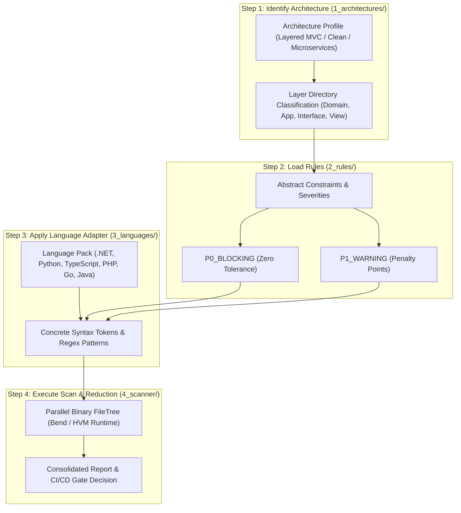

# Scanner Pipeline Definition: Architecture ➔ Rules ➔ Language ➔ Scan

This document defines the formal 4-step execution flow of the **AI Culture & Architecture Guardian**.

---

## 4-Step Execution Pipeline

---

## Step Breakdown

1. **`1_architectures/`**: Establishes the expected structural topology, layer boundaries, and allowed dependency directions.
2. **`2_rules/`**: Specifies what is forbidden or required (e.g. no UI in Domain, zero lazy code) along with penalty weights.
3. **`3_languages/`**: Translates abstract rules into concrete language-specific AST and token detection patterns for C#, Python, TS, PHP, Go, Java, and Bend.
4. **`4_scanner/`**: Dispatches the parallel tree evaluation to the Bend HVM engine, aggregates violations, and enforces the CI/CD quality gate.
