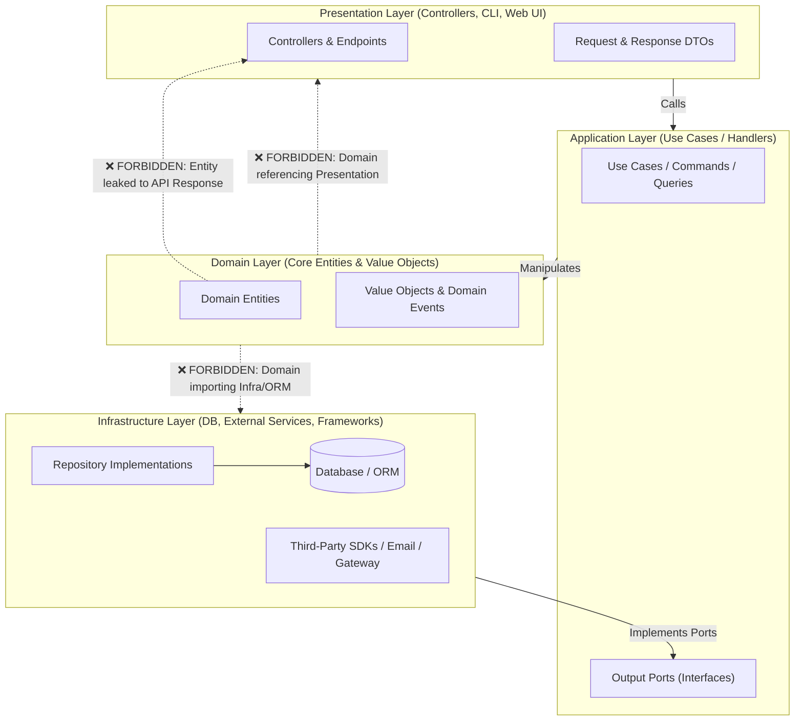

# Engineering & Architecture Standards: Clean Architecture

This document defines architectural isolation standards and layer constraints for projects adopting **Clean Architecture / Hexagonal Architecture / Onion Architecture**.

---

## Architectural Boundary Diagram

---

## Rules Catalog

### `ARCH-CLEAN-01` — Domain Independence from Frameworks & Infra (P0 - Blocking)
- **Description:** The Domain layer (Entities, Value Objects, Domain Services) must never import or depend on infrastructure libraries, ORMs, HTTP clients, or framework-specific modules.
- **Rationale:** Keeps core business logic resilient, long-lived, and easily testable without database or framework mocks.
- **Remediation:** Invert dependencies using interfaces (Ports) declared in Domain/Application and implemented in Infrastructure.

### `ARCH-CLEAN-02` — Strict Inward Dependency Rule (P0 - Blocking)
- **Description:** Dependencies must only flow inwards towards higher-level policies.
- **Rationale:** Protects core business rules from external changes in UI, frameworks, or database drivers.
- **Remediation:** Remove direct outward references and use dependency injection.

### `ARCH-CLEAN-03` — Boundary DTOs and Data Transfer Isolation (P1 - Warning)
- **Description:** Database entities must not be returned directly in public HTTP API responses.
- **Rationale:** Prevents exposing database schema details and avoids unintended leaking of sensitive entity fields.
- **Remediation:** Map Domain/ORM entities into explicit API Response DTOs.
