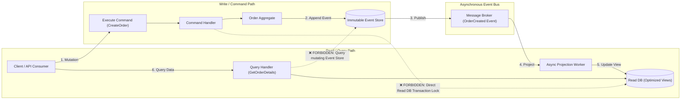

# Engineering & Architecture Standards: CQRS & Event-Driven Architecture

This document defines architectural boundaries for systems utilizing **Command Query Responsibility Segregation (CQRS) and Event Sourcing**.

---

## CQRS Architecture Flow

---

## Rules Catalog

### `ARCH-CQRS-01` — Strict Command & Query Segregation (P0 - Blocking)
- **Description:** Commands mutate state without returning rich query structures; Queries fetch data without causing side-effects or state alterations.
- **Rationale:** Ensures independent scalability, avoids side-effect pollution in read pipelines, and clarifies responsibilities.
- **Remediation:** Separate handlers into distinct `CommandHandler` and `QueryHandler` structures.

### `ARCH-CQRS-02` — Absolute Immutability of Domain Events (P0 - Blocking)
- **Description:** Events stored in the event log must be strictly append-only. Modifying historical events in-place is prohibited.
- **Rationale:** Preserves historical audit integrity and enables reliable event replay for projections.
- **Remediation:** Emit compensating events (e.g. `OrderCancelledEvent`) to reverse or adjust previous states.

### `ARCH-CQRS-03` — Asynchronous Read Projection Decoupling (P1 - Warning)
- **Description:** Read model projections must update out-of-band and never hold synchronous locks on write command transactions.
- **Rationale:** Maintains ultra-low write latency and decouples write availability from projection store outages.
- **Remediation:** Dispatch projection updates via asynchronous subscribers or Kafka/RabbitMQ consumer groups.
