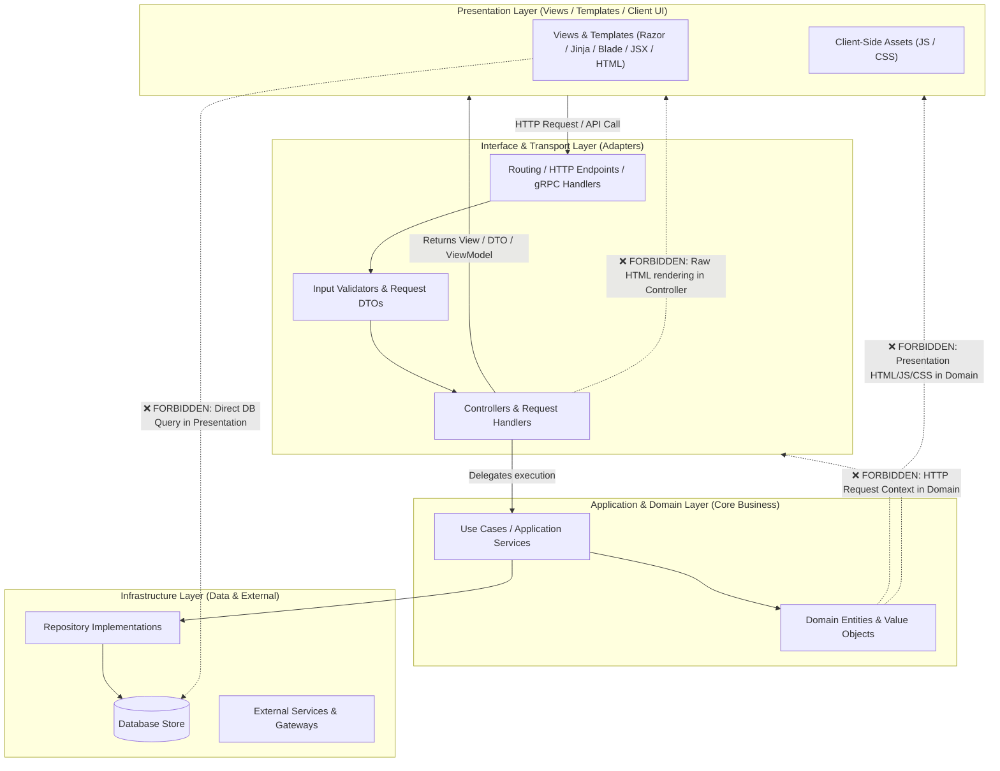

# Engineering & Architecture Standards: Universal Layered & MVC Architecture

This document defines framework-agnostic architectural standards and layer separation rules for multi-tier and MVC applications (covering **.NET / C#, Python / Django / FastAPI, TypeScript / Node / NestJS, Java / Spring Boot, Go, PHP / Laravel, Ruby on Rails**).

---

## Universal Architectural Boundary Diagram

---

## Universal Rules Catalog

### `ARCH-LAYER-01` — Zero Presentation Code in Domain, Models & Controllers (P0 - Blocking)
- **Description:** Strictly forbids embedding presentation markup (`
`, ``, `
`, `<html>`), `<script>`, `<style>` blocks, or client-side DOM manipulation inside Domain, Model, Service, or Controller classes.
- **Rationale:** Strict Separation of Concerns (SoC). Domain/Models manage state; Controllers coordinate flow. Presentation belongs exclusively to Views, Templates, and UI Components.
- **Remediation:** Move presentation markup into dedicated View templates or return structured DTOs / ViewModels.

### `ARCH-LAYER-02` — Zero Direct Database Queries in Presentation & Views (P0 - Blocking)
- **Description:** Direct database queries, raw SQL, or data-access calls inside presentation templates/views are prohibited.
- **Rationale:** Prevents N+1 query performance leaks, data-access logic pollution, and tight coupling between UI and persistence layers.
- **Remediation:** Fetch data in Controllers or Use Cases and pass prepared ViewModels/DTOs to the presentation layer.

### `ARCH-LAYER-03` — Zero Transport Protocol Coupling in Domain Models (P0 - Blocking)
- **Description:** Domain models and entities must not depend on HTTP request contexts, headers, superglobals, or transport session objects.
- **Rationale:** Ensures domain models are decoupled from network transport and reusable across background workers, CLI tools, message queues, and unit tests.
- **Remediation:** Pass primitive types, Value Objects, or domain DTOs explicitly.

### `ARCH-LAYER-04` — Thin Controllers (P1 - Warning)
- **Description:** Controllers and HTTP handlers must act as lightweight coordinators, delegating complex calculations and domain workflows to Application/Domain services.
- **Rationale:** Avoids Fat Controllers, enhances testability, and prevents duplication across multiple entry points (Web, API, CLI, gRPC).
- **Remediation:** Extract business logic into Use Cases or Application Services.

### `ARCH-LAYER-05` — Explicit Input Validation & Boundary DTOs (P1 - Warning)
- **Description:** Mutation endpoints must validate input payloads using strongly-typed Request DTOs, Schemas, or Validators before reaching core services.
- **Rationale:** Centralizes validation, error formatting, and authorization at the boundary.
- **Remediation:** Apply schema validators (e.g. FluentValidation, Zod, Pydantic, Bean Validation) at controller boundaries.
