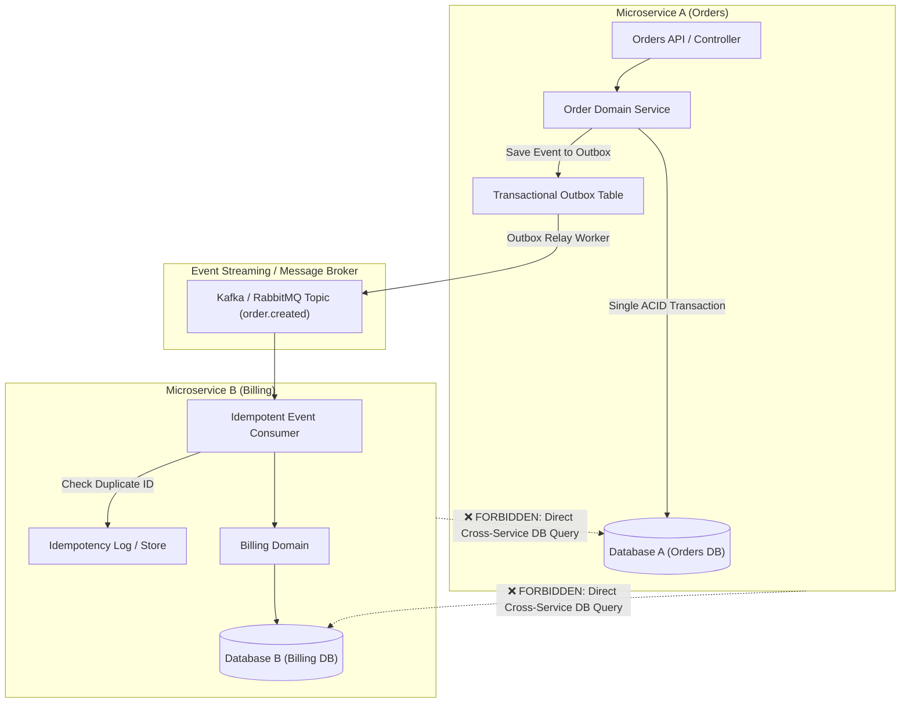

# Engineering & Architecture Standards: Microservices & Distributed Systems

This document defines architectural standards and resilience constraints for **Microservices and Distributed Systems** within the engineering pipeline.

---

## Architectural Boundary & Resilience Diagram

---

## Rules Catalog

### `ARCH-MS-01` — Database-per-Service Isolation (P0 - Blocking)
- **Description:** A microservice must never query, mutate, or share database connections with another microservice's data store.
- **Rationale:** Shared databases create runtime coupling, schema deployment bottlenecks, and break individual team autonomy.
- **Remediation:** Communicate via asynchronous events or synchronous gRPC/REST APIs.

### `ARCH-MS-02` — Mandatory Distributed Tracing & Correlation ID (P1 - Warning)
- **Description:** All incoming and outgoing requests must pass through correlation middleware and propagate `X-Correlation-ID` or W3C `traceparent` headers.
- **Rationale:** Ensures unified end-to-end observability across distributed service boundaries.
- **Remediation:** Configure correlation ID middleware in HTTP/gRPC pipelines and logging contexts.

### `ARCH-MS-03` — Resilient Inter-Service Calls (Timeout & Circuit Breaker) (P0 - Blocking)
- **Description:** Direct HTTP/gRPC client calls must have strict timeouts (e.g., connect timeout <= 2s, read timeout <= 5s) and circuit breaker fallbacks.
- **Rationale:** Eliminates cascading system failures and thread pool starvation during downstream latency spikes.
- **Remediation:** Implement resilience policies with circuit breaker patterns.

### `ARCH-MS-04` — Transactional Outbox Pattern for State-Event Consistency (P1 - Warning)
- **Description:** Domain events emitted from database transactions must be persisted within the same transactional boundary using the Outbox pattern.
- **Rationale:** Prevents dual-write failures (e.g. database commits but event publisher fails, or vice versa).
- **Remediation:** Save events to an Outbox table and use an asynchronous relay worker to dispatch them to the message broker.

### `ARCH-MS-05` — Idempotent Event Consumers (P0 - Blocking)
- **Description:** Message handlers must be resilient to duplicate message delivery.
- **Rationale:** Message brokers guarantee at-least-once delivery; duplicate processing can cause corrupted financial or transactional states.
- **Remediation:** Track processed event IDs or use deterministic state transitions.
