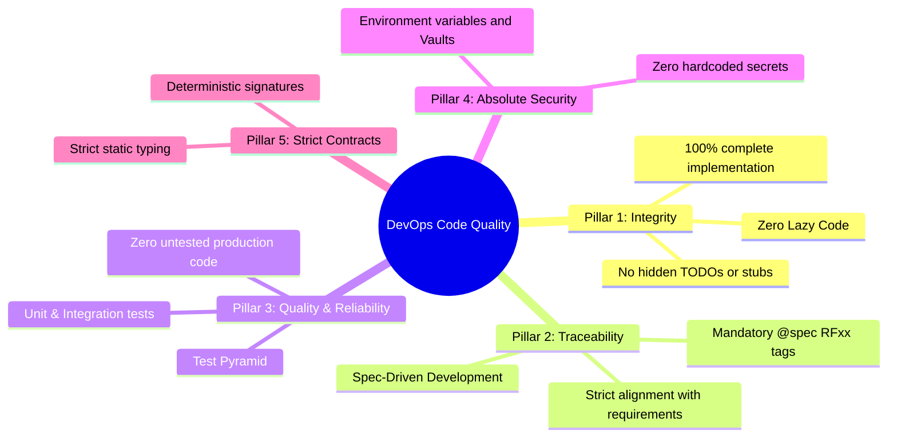

# DevOps Engineering Culture Manifesto & Quality Standards

This document defines the non-negotiable software engineering principles for all source code, pull requests, and continuous delivery artifacts across the repository. The **Bend DevOps Guardian** acts as the automated quality gate for this culture, auditing every submitted change before merge.

---

## The 5 Pillars of DevOps Code Quality & Engineering Standards

---

## Detailed Rules

### `CULT01` — Integrity: Zero Lazy Code (P0 - Blocking)
Production pull requests must not leave incomplete placeholder implementations with comments such as `// TODO: handle other cases` or empty `pass` blocks. Code submitted to CI/CD must be delivered complete and functional, or the scope must be formally tracked in `plan.md`.

### `CULT02` — Traceability: Spec-Driven Development (P1 - Warning)
Each functional component, service, or domain model must declare which specification requirement (`spec.md`) it addresses using the `@spec RF<number>` tag. This guarantees bidirectional traceability between requirements and source code.

### `CULT03` — Reliability: Mandatory Automated Tests (P0 - Blocking)
No line of production code is accepted without a corresponding test file. The development flow must follow TDD discipline (test specification before implementation).

### `CULT04` — Security: Zero Hardcoded Secrets (P0 - Blocking)
API keys, access credentials, JWT tokens, database passwords, or plain-text secrets in source code trigger an immediate merge block.

### `CULT05` — Contracts: Strict Typing (P1 - Warning)
Functions and methods must explicitly declare input parameter types and return types, preventing ambiguity and runtime errors.
