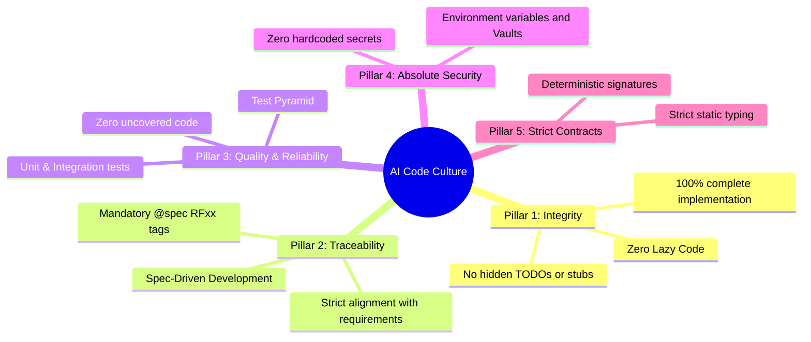

# Engineering Culture Manifesto & Standards for AI Agents

This document defines the non-negotiable software engineering principles for all code generated by AI Agents across the development ecosystem. The **Bend** validator acts as the automated guardian of this culture, auditing every submitted change.

---

## The 5 Pillars of AI Code Culture

---

## Detailed Rules

### `CULT01` — Integrity: Zero Lazy Code (P0 - Blocking)
AI agents tend to summarize implementations with comments such as `// TODO: handle other cases` or empty `pass` blocks. In our ecosystem, this is strictly prohibited. Code must be delivered complete, or the scope must be formally split in `plan.md`.

### `CULT02` — Traceability: Spec-Driven Development (P1 - Warning)
Each functional file or function generated by an AI agent must declare which specification requirement (`spec.md`) it addresses using the `@spec RF<number>` tag. This guarantees bidirectional traceability between product specifications and source code.

### `CULT03` — Reliability: Mandatory Automated Tests (P0 - Blocking)
No line of production code generated by an AI agent is accepted without a corresponding test file. The development flow must follow TDD discipline (test specification in `tests.md` before implementation).

### `CULT04` — Security: Zero Hardcoded Secrets (P0 - Blocking)
API keys, access credentials, JWT tokens, database passwords, or plain-text secrets in source code trigger an immediate merge block.

### `CULT05` — Contracts: Strict Typing (P1 - Warning)
Functions and methods must explicitly declare input parameter types and return types, preventing ambiguity and runtime errors.
