# 📚 Layer Vocabulary & Token Taxonomy

This document formalizes the complete **Layer Vocabulary & Token Taxonomy** for the Architecture & Engineering Culture Guardian. It maps concrete source code tokens, HTML tags, DOM APIs, HTTP context objects, SQL statements, and ORM primitives to their canonical architectural layers, establishing strict boundary rules across framework-agnostic multi-tier systems.

---

## 🧭 Architectural Layer Classification Matrix

```mermaid
flowchart TD
    subgraph PresentationLayer ["1. Presentation Layer (UI & Templates)"]
        UI_Tokens["HTML Tags (<img>, <div>, <form>, <button>)<br/>DOM APIs (document.*, window.*)<br/>Template Directives ({{ }}, *ngIf, v-model)"]
    end

    subgraph InterfaceLayer ["2. Interface & Transport Layer"]
        HTTP_Tokens["HTTP Contexts (HttpContext, HttpRequest, express.Request)<br/>Superglobals ($_GET, $_POST, request())<br/>Routing Attributes ([ApiController], @RestController)"]
    end

    subgraph ApplicationLayer ["3. Application / Use Case Layer"]
        App_Tokens["Use Cases, Command Handlers, Workflow Orchestration<br/>DTOs, Application Mappings"]
    end

    subgraph DomainLayer ["4. Domain Layer (Pure Enterprise Core)"]
        Domain_Tokens["Entities (Entity&lt;T&gt;), Value Objects (ValueObject)<br/>Aggregate Roots (AggregateRoot), Domain Events (IDomainEvent)<br/>Business Invariants & Specifications"]
    end

    subgraph InfrastructureLayer ["5. Infrastructure & Persistence Layer"]
        DB_Tokens["SQL Queries (SELECT, INSERT, UPDATE, DELETE)<br/>ORM Primitives (DbContext, DbSet&lt;T&gt;, EntityManager, DB::table)<br/>I/O SDKs (S3Client, RedisClient, KafkaProducer)"]
    end

    PresentationLayer -->|Dispatches Actions / Requests| InterfaceLayer
    InterfaceLayer -->|Executes Use Cases| ApplicationLayer
    ApplicationLayer -->|Manipulates Invariants| DomainLayer
    ApplicationLayer -->|Persists State via Repositories| InfrastructureLayer

    PresentationLayer -. "❌ FORBIDDEN: Direct SQL / ORM" .-> InfrastructureLayer
    DomainLayer -. "❌ FORBIDDEN: UI Markup & DOM" .-> PresentationLayer
    DomainLayer -. "❌ FORBIDDEN: HTTP Request Context" .-> InterfaceLayer
    InterfaceLayer -. "❌ FORBIDDEN: Direct UI Markup Output" .-> PresentationLayer
```

---

## 1. Presentation Layer (`LAYER_PRESENTATION`)

### Definition & Scope
The **Presentation Layer** contains client-facing UI templates, markup, client-side styling, and client DOM manipulation. Tokens in this layer must **never** appear in Domain, Application, Service, or Infrastructure layers.

### Token Taxonomy

| Category | Concrete Tokens & Words | Canonical File Extensions | Forbidden In Layers |
| :--- | :--- | :--- | :--- |
| **HTML Tags** | ``, `</img>`, ``, `
`, `<div`, ``, ``, `
`, `<a>`, `<form>`, `</form>`, `<input>`, `<button>`, `</button>`, `<select>`, `<option>`, `<table>`, `<tr>`, `<td>`, `<th>`, `<header>`, `<footer>`, `<nav>`, `<main>`, `<section>`, `<article>`, `<aside>`, `<h1>`-`<h6>`, `<ul>`, `<li>`, `<ol>`, `<script>`, `<style>`, `<link`, `<meta`, `<canvas`, `<svg`, `<iframe>` | `.html`, `.cshtml`, `.razor`, `.blade.php`, `.jinja`, `.tsx`, `.vue` | `Domain`, `Model`, `Application`, `Service`, `Infrastructure` |
| **DOM APIs** | `document.getElementById`, `document.querySelector`, `document.querySelectorAll`, `document.createElement`, `window.location`, `window.localStorage`, `window.sessionStorage`, `window.addEventListener`, `alert()`, `confirm()`, `prompt()` | `.js`, `.ts`, `.tsx`, `.vue` | `Domain`, `Model`, `Application`, `Service`, `Infrastructure` |
| **Template Directives** | `@extends`, `@section`, `@yield`, `@include`, `@component`, ``, ``, `{{`, `}}`, `*ngIf`, `*ngFor`, `v-if`, `v-for`, `v-bind`, `v-model` | `.cshtml`, `.blade.php`, `.jinja2`, `.html` | `Domain`, `Model`, `Application`, `Service`, `Infrastructure` |
| **Raw Rendering Methods** | `echo "<"`, `echo '<'`, `print("<"`, `print('<'`, `Response.Write("<"`, `Response.Write('<'`, `innerHTML`, `outerHTML` | `.cs`, `.py`, `.ts`, `.php`, `.java`, `.go` | `Domain`, `Model`, `Application`, `Service`, `Controller` |

---

## 2. Interface & Transport Layer (`LAYER_INTERFACE_TRANSPORT`)

### Definition & Scope
The **Interface & Transport Layer** handles ingress communication protocols (HTTP, gRPC, WebSocket, CLI). It coordinates incoming payloads, translates requests into Application commands, and returns formatted responses or ViewModels.

### Token Taxonomy

| Category | Concrete Tokens & Words | Framework Equivalents | Forbidden In Layers |
| :--- | :--- | :--- | :--- |
| **HTTP Contexts** | `HttpContext`, `HttpRequest`, `HttpResponse`, `Request.Headers`, `Request.Query`, `Request.Cookies`, `Request.Form`, `express.Request`, `express.Response`, `fastapi.Request`, `fastapi.Response`, `gin.Context`, `echo.Context`, `fiber.Ctx`, `HttpServletRequest`, `HttpServletResponse` | ASP.NET Core, Express.js, FastAPI, Gin, Echo, Fiber, Spring MVC | `Domain`, `Model`, `Entity`, `Presentation` |
| **Superglobals & Helpers** | `request()`, `Request::`, `$_GET`, `$_POST`, `$_REQUEST`, `$_SERVER`, `$_COOKIE`, `$_SESSION`, `$_FILES` | PHP / Laravel, Global HTTP handlers | `Domain`, `Model`, `Entity`, `Presentation` |
| **Routing Attributes** | `[ApiController]`, `[HttpGet]`, `[HttpPost]`, `[HttpPut]`, `[HttpDelete]`, `[Route()]`, `@RestController`, `@GetMapping`, `@PostMapping`, `@RequestMapping`, `@Controller()` | .NET, Spring Boot, NestJS | `Domain`, `Model`, `Entity`, `Infrastructure` |

---

## 3. Infrastructure & Persistence Layer (`LAYER_INFRASTRUCTURE_PERSISTENCE`)

### Definition & Scope
The **Infrastructure Layer** encapsulates external systems, relational databases, document stores, caches, message brokers, and third-party web services.

### Token Taxonomy

| Category | Concrete Tokens & Words | Supported Stacks | Forbidden In Layers |
| :--- | :--- | :--- | :--- |
| **SQL Keywords** | `SELECT * FROM`, `SELECT `, `INSERT INTO `, `UPDATE `, `DELETE FROM `, `DROP TABLE`, `ALTER TABLE`, `INNER JOIN `, `LEFT JOIN `, `RIGHT JOIN `, ` GROUP BY `, ` ORDER BY `, ` HAVING ` | Raw SQL, ANSI SQL, DDL, DML | `Presentation`, `View`, `Domain`, `Template` |
| **ORM Primitives** | `DbContext`, `DbSet<T>`, `EntityManager`, `DB::table`, `DB::raw`, `DB::select`, `Model::where`, `Model::all`, `Model::find`, `::where(`, `::query(`, `objects.filter(`, `objects.all(`, `objects.get(`, `gorm.DB`, `db.Where(`, `db.Query(`, `prisma.`, `mongoose.model`, `typeorm` | EF Core, Hibernate, Eloquent, Django ORM, GORM, Prisma, TypeORM | `Presentation`, `View`, `Domain`, `Template` |
| **Storage & Messaging** | `S3Client`, `BlobServiceClient`, `RedisClient`, `KafkaProducer`, `KafkaConsumer`, `RabbitMQClient`, `AmqpChannel` | AWS SDK, Azure SDK, Redis, Apache Kafka, RabbitMQ | `Presentation`, `View`, `Domain` |

---

## 4. Domain Layer (`LAYER_DOMAIN_CORE`)

### Definition & Scope
The **Domain Layer** represents the enterprise business core. It contains entities, value objects, domain invariants, aggregate roots, domain events, and pure business calculations. It has **zero dependencies** on UI markup, databases, or transport frameworks.

### Token Taxonomy

| Category | Concrete Tokens & Words | Paradigms | Forbidden In Layers |
| :--- | :--- | :--- | :--- |
| **Domain Primitives** | `AggregateRoot`, `Entity<T>`, `ValueObject`, `IDomainEvent`, `DomainEvent`, `Specification<T>`, `BusinessRuleValidationException` | DDD (Domain-Driven Design), Clean Architecture | `Presentation` |

---

## 5. Token Violation Detection Rules Summary

The following table summarizes the automated rule mappings enforced during static analysis:

| Rule ID | Forbidden Token Set | Checked Target Layers | Severity | Penalty |
| :--- | :--- | :--- | :--- | :--- |
| **`ARCH-LAYER-01`** | ``, `
`, `<script>`, `document.*`, `echo "<"`, `innerHTML` | `Domain`, `Model`, `Service`, `Controller` | `P0_BLOCKING` | 40 pts |
| **`ARCH-LAYER-02`** | `SELECT * FROM`, `DbContext`, `DB::table`, `objects.filter()`, `prisma.` | `View`, `Template`, `Presentation` | `P0_BLOCKING` | 35 pts |
| **`ARCH-LAYER-03`** | `HttpContext`, `HttpRequest`, `express.Request`, `$_POST`, `request()` | `Domain`, `Model`, `Entity` | `P0_BLOCKING` | 30 pts |
| **`ARCH-FE-01`** | `fetch(`, `axios.`, `http.get(`, `http.post(` | `PresentationalUI` (Pure UI components) | `P0_BLOCKING` | 35 pts |

---

## 6. Related Manifests & Configuration

- Schema definition: [`rules_schema.json`](./rules_schema.json)
- Machine-readable vocabulary: [`layer_vocabulary.json`](./layer_vocabulary.json)
- Layer boundary rules: [`2_rules/layer_boundaries.json`](./2_rules/layer_boundaries.json)
- Language adapters: [`3_languages/`](./3_languages/)
- Architecture profiles: [`1_architectures/`](./1_architectures/)
