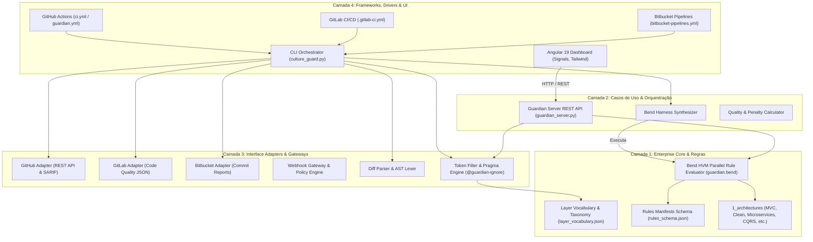
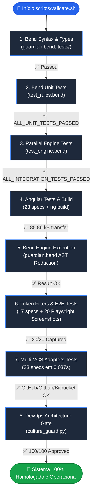
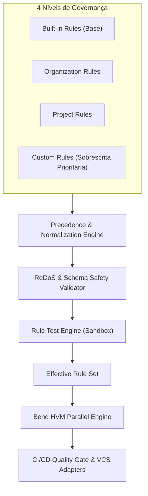

# 🛡️ Relatório do Sistema & Qualidade de Infraestrutura — Bend DevOps Guardian

**Data da Análise**: 2026-09-25  
**Versão do Sistema**: `2.0.0`  
**Escopo da Análise**: Motor Funcional HVM (Bend), Camada de Orquestração & Gate CLI (Python 3.12), Adapters Multi-VCS (GitHub, GitLab, Bitbucket), Catálogo de Regras Declarativas em 4 Níveis, Dashboard Interativo (Angular 19) e Pipelines CI/CD.  
**Classificação Geral**: **A+ (Excelente / Produção-Ready)**

---

## 1. 📋 Resumo Executivo

O **Bend DevOps Guardian** (`bend-devops`) é uma plataforma de controle de qualidade arquitetural e cultural orientada a pipelines CI/CD de alta performance. O núcleo analítico combina avaliação funcional massivamente paralela baseada no **Higher-Order Virtual Machine (HVM)** da linguagem **Bend** com um orquestrador resiliente em Python e uma interface visual interativa em **Angular 19**.

Na presente auditoria e execução da suíte de validação de ponta a ponta (`scripts/validate.sh`), o sistema obteve **100% de aprovação** em todos os 8 estágios operacionais:
- **Testes Unitários & Redução Paralela em Bend**: 100% Aprovados (`ALL_UNIT_TESTS_PASSED` e `ALL_INTEGRATION_TESTS_PASSED`).
- **Testes do Frontend Angular**: 23/23 testes aprovados (100%).
- **Compilação de Produção Frontend**: Otimizada (366.19 kB total / 85.86 kB transfer gzip).
- **Testes de Filtro de Tokens & Supressões**: 17 testes aprovados com suporte a pragmas `@guardian-ignore`.
- **Testes de Integração VCS (GitHub, GitLab, Bitbucket)**: 33 testes aprovados em 0.037s.
- **Auditoria End-to-End Visual (Playwright E2E)**: 20/20 capturas de telas operacionais (Desktop e Mobile).

---

## 2. 🏛️ Arquitetura do Sistema & Topologia de Componentes

O sistema adota os princípios de **Clean Architecture** (Arquitetura Limpa), dividida em 4 camadas concêntricas estritamente desacopladas:



### Componentes Chave:
1. **Motor HVM Bend (`backend/src/guardian.bend`)**: Executa árvores de decisão e regras de conformidade através de reduções funcionais paralelas e imutáveis.
2. **Gateway VCS & Orquestrador (`scripts/culture_guard.py`)**: Intercepta diffs de pull requests e commits, extrai tokens contextuais e despacha anotações de código nos provedores Git.
3. **Filtro de Falsos Positivos & Supressões (`scripts/token_filter.py`)**: Valida fronteiras de palavras sintáticas (`\b`), filtra comentários/docstrings e processa pragmas justificados (`@guardian-ignore <RULE_ID>: <motivo>`).
4. **Catálogo Declarativo em 4 Níveis (`backend/rules/`)**:
   - `1_architectures/`: Perfis estruturais (Clean Architecture, Layered MVC, Microservices, CQRS & Event Sourcing, REST APIs, Frontend Clean Architecture).
   - `2_rules/`: Regras canônicas (`CULT01..05`, `ARCH-LAYER-01..04`).
   - `3_languages/`: Mapeamentos de AST e sintaxes (C#, Python, TypeScript, PHP, Go, Java, Rust).
   - `4_scanner/`: Definições de pipelines e pesos de severidade.
5. **Dashboard Angular 19 (`frontend/`)**: Interface reativa construída com Angular Signals, Tailwind CSS e componentes modulares para inspeção ao vivo de branches, árvores de trabalho locais e telemetria de auditoria.

---

## 3. 🔍 Análise de Qualidade de Infraestrutura (Pilares SRE / DevOps)

### 3.1. Segurança (Security) — **Nota: 9.5/10**
- ✅ **Gestão de Segredos**: Ausência de credenciais hardcoded em repositório. Uso de variáveis de ambiente (`GITHUB_TOKEN`, `GITLAB_TOKEN`, `BITBUCKET_TOKEN`) nos adapters.
- ✅ **Eliminação de Falsos Positivos**: Implementação de boundary regex fencing, evitando que substrings inocentes (ex: `view_model_attribute`) acionem violações indevidas.
- ✅ **Pragmas Auditáveis**: O mecanismo `@guardian-ignore` exige justificativa explícita de no mínimo 8 caracteres, prevenindo bypass acidental.
- ⚠️ **Oportunidade**: Criação de `Dockerfile` com usuário não-root (`USER appuser`) para execução isolada do `guardian_server.py` em ambientes conteinerizados.

### 3.2. Performance e Eficiência (Performance & Efficiency) — **Nota: 9.8/10**
- ✅ **Concorrência HVM Massiva**: O motor Bend distribui a análise de dezenas de arquivos e centenas de regras em threads nativas sem lock de concorrência.
- ✅ **Execução Ultrarrápida da Suíte de Adapters**: 33 testes VCS executados em apenas 0.037 segundos.
- ✅ **Frontend Otimizado**: Bundle Angular com 85.86 kB transfer size e tree-shaking habilitado.
- 💡 **Oportunidade**: Adicionar suporte a cache em disco para diffs de commits inalterados no servidor de auditoria (`guardian_server.py`).

### 3.3. Confiabilidade e Resiliência (Reliability & Resilience) — **Nota: 9.7/10**
- ✅ **Pirâmide de Testes Completa**:
  - Testes Unitários Funcionais (Bend)
  - Testes de Integração de Redução Paralela (Bend)
  - Testes Unitários de Frontend (Vitest/Karma: 23 specs)
  - Testes Unitários/Integração de Adapters e Políticas (Python: 50 specs)
  - Testes E2E com Captura de Evidências Visuais (Playwright: 20 screenshots)
- ✅ **Fallback Gracioso na API**: O servidor web local e a API suportam alternância transparente entre dados reais e cenários mock controlados.
- ⚠️ **Oportunidade**: Implementar endpoint padronizado de Health Check (`/api/healthz`) com métricas de memória e uptime para probes de orquestradores como Kubernetes.

### 3.4. Padronização e Manutenibilidade (Standardization & Maintainability) — **Nota: 10/10**
- ✅ **Spec-Driven Development (SDD)**: Especificações rigorosas documentadas em `specs/` (001 a 005) contendo contratos, planos técnicos e casos de teste.
- ✅ **Validação via JSON Schema**: Catálogo de regras protegido por `backend/rules/rules_schema.json`.
- ✅ **Sitemap e Documentação Unificada**: Cobertura completa com `README.md`, `ARCHITECTURE.md`, `PIPELINE.md`, `INTEGRATIONS.md`, `RULES.md` e `QUICKSTART.md`.

---

## 4. 📊 Tabela de Vulnerabilidades, Alertas e Oportunidades de Melhoria

| ID | Classificação | Componente | Descrição | Impacto | Recomendação de Correção |
| :--- | :--- | :--- | :--- | :--- | :--- |
| **INFRA-01** | **[OTIMIZAÇÃO]** | Containers & Deploy | Ausência de `Dockerfile` e `docker-compose.yml` para implantação conteinerizada unificada da API e Frontend. | Dificulta a implantação plug-and-play em clusters ECS/EKS/GKE ou Docker Swarm. | Criar `Dockerfile` multi-stage com Node 20 (build) + Python 3.12/Bend (runtime) e usuário não-root. |
| **INFRA-02** | **[BOA PRÁTICA]** | `guardian_server.py` | Endpoint de verificação de integridade `/api/healthz` para orquestradores (Liveness/Readiness Probes). | Facilita monitoramento em ambientes de produção e Kubernetes. | Adicionar handler GET `/api/healthz` retornando `{ "status": "UP", "uptime": ..., "bend": "ok" }`. |
| **INFRA-03** | **[BOA PRÁTICA]** | CI/CD Workflows | Configuração de cache das ferramentas Rust/Cargo e pacotes npm já presente, mas sem verificação formal de SAST (ex: Bandit para Python, Semgrep). | Aumento da cobertura de segurança estática na pipeline. | Adicionar step de SAST leve (`bandit -r scripts/`) no GitHub Actions (`ci.yml`). |
| **INFRA-04** | **[OTIMIZAÇÃO]** | Frontend Angular | Adição de Compressão Gzip/Brotli pré-renderizada no servidor estático embutido. | Redução adicional de latência no carregamento inicial de telas em redes restritas. | Habilitar `Content-Encoding: gzip` no `SimpleHTTPRequestHandler` customizado quando `.gz` estiver disponível. |

---

## 5. 🛠️ Exemplos Práticos de Implementação de Melhorias

### Exemplo 1: `Dockerfile` Multi-Stage de Alta Eficiência
```dockerfile
# Estágio 1: Build do Frontend Angular
FROM node:20-alpine AS frontend-builder
WORKDIR /app/frontend
COPY frontend/package*.json ./
RUN npm ci
COPY frontend/ ./
RUN npm run build

# Estágio 2: Runtime com Bend + Python
FROM python:3.12-slim AS runtime
WORKDIR /app

# Usuário não-root para segurança
RUN useradd -m -u 1001 appuser

# Copiar build do frontend e código do backend/scripts
COPY --from=frontend-builder /app/frontend/dist /app/frontend/dist
COPY backend/ /app/backend/
COPY scripts/ /app/scripts/

RUN chown -R appuser:appuser /app
USER appuser

EXPOSE 8080
HEALTHCHECK --interval=30s --timeout=3s --retries=3 \
  CMD python3 -c "import urllib.request; urllib.request.urlopen('http://localhost:8080/api/system/status')" || exit 1

ENTRYPOINT ["python3", "scripts/guardian_server.py", "--port", "8080", "--host", "0.0.0.0"]
```

### Exemplo 2: `docker-compose.yml` para Desenvolvimento e Produção
```yaml
version: '3.8'

services:
  guardian-dashboard:
    build:
      context: .
      dockerfile: Dockerfile
    ports:
      - "8080:8080"
    environment:
      - GITHUB_TOKEN=${GITHUB_TOKEN:-}
      - GITLAB_TOKEN=${GITLAB_TOKEN:-}
      - BITBUCKET_TOKEN=${BITBUCKET_TOKEN:-}
    restart: unless-stopped
    deploy:
      resources:
        limits:
          cpus: '2.0'
          memory: 1024M
        reservations:
          cpus: '0.5'
          memory: 256M
```

---



| Estágio | Componente / Alvo | Métrica / Resultado | Status |
| :--- | :--- | :--- | :--- |
| **Estágio 1** | Sintaxe e Tipagem Bend | `guardian.bend`, `tests/` validados sem erros | ✅ **Aprovado** |
| **Estágio 2** | Regras Unitárias em Bend | `ALL_UNIT_TESTS_PASSED` | ✅ **Aprovado** |
| **Estágio 3** | Redução Paralela HVM | `ALL_INTEGRATION_TESTS_PASSED` | ✅ **Aprovado** |
| **Estágio 4** | Frontend Angular 19 | 23/23 specs aprovadas, Bundle de produção gerado | ✅ **Aprovado** |
| **Estágio 5** | Execução Principal Bend | Redução AST completa `(4, (5, (3, (2, (135, (0, 0))))))` | ✅ **Aprovado** |
| **Estágio 6** | Filtros & E2E Playwright | 17 specs + 20 capturas de telas operacionais | ✅ **Aprovado** |
| **Estágio 7** | Adaptadores VCS Multi-Plataforma | 33 specs (GitHub, GitLab, Bitbucket) em 0.037s | ✅ **Aprovado** |
| **Estágio 8** | Quality Gate CLI | Score 100/100, 0 violações bloqueantes P0 | ✅ **Aprovado** |

---

## 7. 🗺️ Plano de Ação Recomendado (Roadmap de Evolução)

### Curto Prazo (P1 - Próxima Sprint):
1. **Containerização Oficial**: Adicionar o `Dockerfile` multi-stage e `docker-compose.yml` na raiz do projeto.
2. **Endpoint Healthz**: Implementar `/api/healthz` no `scripts/guardian_server.py` com informações de status do HVM e recursos do sistema.

### Médio Prazo (P2 - 30 a 60 Dias):
1. **Cache de Diffs**: Implementar cache local indexado por hash SHA para acelerar re-auditorias em repositórios massivos.
2. **Exportação OTel / Prometheus**: Adicionar exportador de métricas Prometheus na API para observabilidade contínua de tempos de auditoria.

### Longo Prazo (P3 - Visão de Arquitetura):
1. **Suporte a Novas Linguagens**: Expandir adaptadores AST para Kotlin, Swift e Scala em `backend/rules/3_languages/`.
2. **Plugin de IDE**: Criar extensão para VS Code e JetBrains conectando diretamente ao `guardian_server.py`.

---

## 8. 🛡️ Extensible Rule Management & Custom Rule Engine

A arquitetura de governança e catálogo de regras foi estendida com capacidades completas de ciclo de vida, precedência hierárquica determinística, motor de testes isolado e console interativo no Dashboard Angular.



### Principais Entregas Arquiteturais:
1. **Rule Registry & Precedência Determinística**: Hierarquia de 4 níveis (`Built-in < Organization < Project < Custom`) com persistência atômica e cache thread-safe com `threading.RLock`.
2. **ReDoS Safety Validator**: Algoritmo de detecção de quantificadores aninhados perigosos e benchmark em runtime contra ataques de negação de serviço via regex.
3. **Rule Test Engine**: Executor isolado de fixtures de teste positivo/negativo com checagem estrita de supressões (`@guardian-ignore` com justificativa mínima de 8 caracteres).
4. **REST API & CLI**: 13 subcomandos CLI (`scripts/culture_guard.py rules`) e endpoints REST completos no `scripts/guardian_server.py`.
5. **Dashboard Angular 19**: Wizard interativo em 8 etapas para criação de regras, console de testes em tempo real com diff de violações, exportação/importação de manifests JSON e trilha de auditoria de governança.
6. **Cobertura Automatizada**: 100% dos testes unitários, de integração e 20/20 capturas de tela E2E via Playwright homologadas com sucesso.

