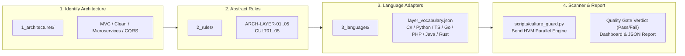
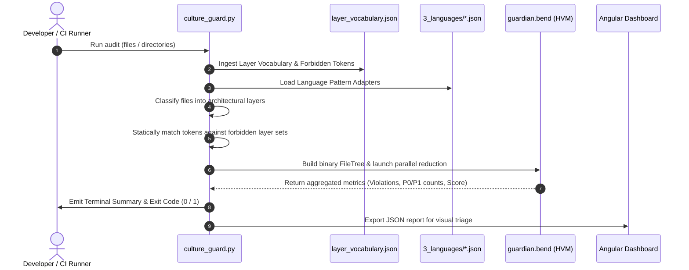

# Specification: Universal 4-Tier Architecture & Layer Guardian

This document specifies the architecture and technical requirements for the **Universal 4-Tier Architecture & Layer Guardian**. The system is completely framework- and language-agnostic. It operates over a structured 4-tier pipeline (`1. Architecture ➔ 2. Rules ➔ 3. Language ➔ 4. Scan & Report`), classifies folder topologies into canonical layers, checks token containment via an exhaustive token vocabulary taxonomy, and executes massively parallel AST/file-tree reductions on the Bend (HVM) runtime.

---

## 1. Objective

Provide an automated, deterministic 4-stage validation pipeline:
1. **Identify Architecture**: Classify system topologies (`Layered / MVC`, `Clean Architecture`, `Microservices`, `CQRS & Event Sourcing`, `REST API`, `Frontend Clean Architecture`).
2. **Rules Evaluation**: Enforce abstract boundary constraints (`ARCH-LAYER-01` to `05`, `CULT01` to `05`).
3. **Language Adapters**: Map language-specific syntax patterns (.NET/C#, Python, TypeScript, PHP, Go, Java, Rust).
4. **Scanner & Reporting**: Parallel tree reduction producing reproducible CI/CD quality gate verdicts and interactive dashboard analytics.

---

## 2. Functional Requirements

| ID | Description | Actor | Priority |
| :--- | :--- | :--- | :--- |
| **RF01** | **Topology & Layer Identification**: Automatically classify directories and source files into canonical layers (`Domain`, `Application`, `Interface / Transport`, `Presentation / UI`, `Infrastructure / Persistence`). | Layer Classifier | High |
| **RF02** | **Layer Vocabulary & Token Taxonomy**: Statically verify that words, tags, and symbols strictly belong to their permitted layers (e.g. HTML tags ``, `
`, `<form>`, `<button>` belong strictly to Presentation/UI; SQL `SELECT`, `DbContext`, `objects.filter()` belong strictly to Infrastructure). | Token Engine | High |
| **RF03** | **Zero Presentation Leakage (`ARCH-LAYER-01`)**: Block presentation HTML/JSX markup, client scripts (`<script>`, `document.*`), and styling inside Domain, Model, Service, and Controller layers. | Rule Engine | High |
| **RF04** | **Zero Database Leaks in Views (`ARCH-LAYER-02`)**: Block direct SQL queries or ORM calls (`DbContext`, `DB::table`, `objects.filter()`, `prisma.`) inside Presentation templates. | Rule Engine | High |
| **RF05** | **Zero Transport Coupling in Domain (`ARCH-LAYER-03`)**: Block HTTP transport contexts (`HttpContext`, `HttpRequest`, `express.Request`, `$_POST`, `request()`) inside Domain Models and Entities. | Rule Engine | High |
| **RF06** | **Multi-Language Adapter Support**: Support language-specific file extensions and token dictionaries across C#, Python, TypeScript, PHP, Go, Java, and Rust. | Language Adapter | High |
| **RF07** | **Parallel HVM Tree Reduction**: Compile audited file metadata into an algebraic binary `FileTree` and evaluate rule penalties in parallel on the Bend runtime without GIL locks. | Bend Engine | High |
| **RF08** | **Consolidated Quality Gate Reporting**: Generate structured reports (Text, JSON, Markdown) with compliance scores (0–100), violation penalty aggregations, and CI/CD exit codes (`0` for pass, `1` for block). | Reporter / Gate | High |
| **RF09** | **Interactive Web Dashboard**: Provide an Angular 19+ dashboard displaying real-time compliance metrics, interactive code diff simulations, rule catalog inspection, and violation triage. | User / Web UI | High |

---

## 3. Non-Functional Requirements

| ID | Category | Description |
| :--- | :--- | :--- |
| **RNF01** | **Framework Independence** | Zero coupling to specific frameworks; adaptable to .NET, Django, Spring Boot, NestJS, Gin, Laravel, React, and Angular. |
| **RNF02** | **High-Throughput Performance** | Sub-second analysis (<500ms) for 100+ files using Bend parallel tree reductions on multi-core HVM. |
| **RNF03** | **Deterministic Auditing** | Purely functional, stateless evaluation ensuring 100% reproducible gate decisions across local CLI and CI/CD pipelines. |
| **RNF04** | **Declarative Modularity** | Rule profiles, language adapters, and architecture manifests are organized into distinct folders (`1_architectures/`, `2_rules/`, `3_languages/`, `4_scanner/`) validated against [`rules_schema.json`](../../backend/rules/rules_schema.json). |

---

## 4. Layer Vocabulary & Token Matrix

| Canonical Layer | Concrete Tokens & Words | Allowed In Layers | Forbidden In Layers |
| :--- | :--- | :--- | :--- |
| **`Presentation / UI`** | ``, `
`, ``, `<form>`, `<input>`, `<button>`, `<select>`, `<table>`, `<script>`, `<style>`, `document.getElementById`, `window.location`, `{{ }}`, `*ngIf`, `v-model` | `Presentation`, `Templates`, `Views` | `Domain`, `Model`, `Application`, `Service`, `Infrastructure` |
| **`Interface / Transport`** | `HttpContext`, `HttpRequest`, `express.Request`, `fastapi.Request`, `gin.Context`, `$_GET`, `$_POST`, `request()`, `[ApiController]`, `@RestController` | `Controllers`, `Endpoints`, `Adapters` | `Domain`, `Model`, `Entity`, `Presentation` |
| **`Infrastructure / DB`** | `SELECT * FROM`, `INSERT INTO`, `DbContext`, `DbSet<T>`, `EntityManager`, `DB::table`, `objects.filter()`, `prisma.`, `gorm.DB`, `RedisClient`, `KafkaProducer` | `Infrastructure`, `Repositories`, `Data` | `Presentation`, `Views`, `Domain`, `Templates` |
| **`Domain Core`** | `AggregateRoot`, `Entity<T>`, `ValueObject`, `IDomainEvent`, `Specification<T>` | `Domain`, `Entities`, `Models` | `Presentation` |

---

## 5. UML & Architectural Diagrams (Mermaid)

### 5.1. 4-Stage Pipeline Workflow

### 5.2. Audit Execution Sequence

---

## 6. Out of Scope

- Dynamic runtime memory profiling and live code execution.
- AST compilation to machine code (performed by the native compiler of the respective language).
