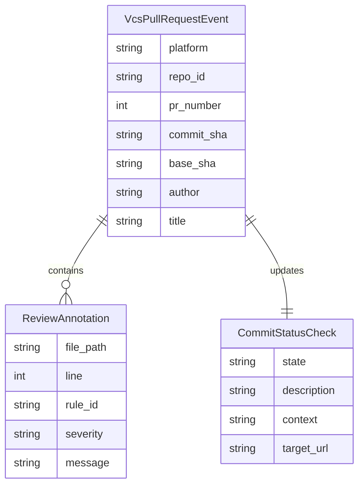

# Data Model: Multi-Platform VCS Integration

This document defines the core data entities and payloads used by the VCS integration layer across GitHub, GitLab, and Bitbucket.

---

## 1. Entities

### 1.1. `VcsPullRequestEvent`
Represents an incoming PR or MR review request.

| Field | Type | Required | Description |
| :--- | :--- | :--- | :--- |
| `platform` | string (`github` \| `gitlab` \| `bitbucket`) | Yes | Target VCS hosting platform |
| `repo_id` | string | Yes | Repository identifier or slug (e.g. `owner/repo`) |
| `pr_number` | integer | Yes | Pull Request or Merge Request numeric ID |
| `commit_sha` | string | Yes | Full Git SHA of the head commit under review |
| `base_sha` | string | Yes | Base branch target commit SHA |
| `author` | string | Yes | Username or handle of the author / contributor |
| `title` | string | Yes | Title of the Pull/Merge Request |

---

### 1.2. `ReviewAnnotation`
Line-level inline violation annotation displayed in code review diffs.

| Field | Type | Required | Description |
| :--- | :--- | :--- | :--- |
| `file_path` | string | Yes | Relative path of the audited source file |
| `line` | integer | Yes | 1-indexed target line number |
| `rule_id` | string | Yes | Rule identifier (e.g. `ARCH-LAYER-01`, `CULT01`) |
| `severity` | string | Yes | `P0_BLOCKING`, `P1_WARNING`, or `P2_INFO` |
| `title` | string | Yes | Short summary title of the violation |
| `message` | string | Yes | Detailed failure explanation and remediation advice |

---

### 1.3. `CommitStatusCheck`
Status badge attached to the Git commit / PR build.

| Field | Type | Required | Description |
| :--- | :--- | :--- | :--- |
| `state` | string (`success` \| `failure` \| `pending`) | Yes | Build gate verdict |
| `target_url` | string | No | URL to detailed report dashboard or CI job |
| `description` | string | Yes | Short summary text (e.g. `Score: 95/100 · 0 Blocking Issues`) |
| `context` | string | Yes | Status context label (e.g. `guardian/devops-architecture`) |

---

## 2. Entity-Relationship Diagram (Mermaid)

