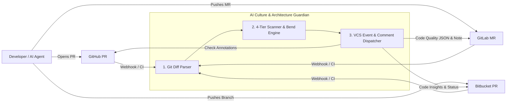
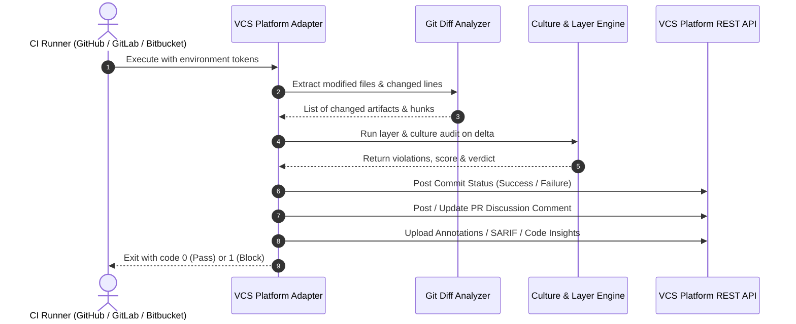

# Specification: Multi-Platform VCS Integration (GitHub, GitLab, Bitbucket)

This specification defines the requirements and architecture for integrating the **AI Culture & Architecture Guardian** directly into **GitHub**, **GitLab**, and **Bitbucket** CI/CD pipelines, pull requests, merge requests, and automated webhook workflows.

---

## 1. Objective

Provide an enterprise-grade, multi-platform VCS adapter suite that automatically audits Pull Requests (GitHub), Merge Requests (GitLab), and PRs (Bitbucket). The system executes the 4-tier Guardian scanner, generates native inline annotations, posts consolidated audit summaries to PR discussions, produces SARIF and Code Climate JSON artifacts, and sets commit statuses to enforce quality gates.

---

## 2. Functional Requirements

| ID | Description | Actor | Priority |
| :--- | :--- | :--- | :--- |
| **RF01** | **GitHub Integration**: Parse GitHub PR events, post check runs via GitHub REST/GraphQL API, emit inline diff annotations, and export SARIF reports. | GitHub Adapter | High |
| **RF02** | **GitLab Integration**: Run in GitLab CI/CD jobs, publish GitLab Code Quality JSON (`gl-code-quality-report.json`), post MR review discussions, and set commit statuses. | GitLab Adapter | High |
| **RF03** | **Bitbucket Integration**: Process Bitbucket Pipelines builds, publish Bitbucket Code Insights reports with line-level annotations, and update build commit statuses. | Bitbucket Adapter | High |
| **RF04** | **Incremental Diff Scanning**: Extract only modified files and changed line numbers from `git diff` / PR patch metadata to focus audits exclusively on MR deltas. | Diff Engine | High |
| **RF05** | **Unified Webhook Gateway**: Provide a lightweight HTTP receiver capable of ingesting webhook payloads from GitHub, GitLab, and Bitbucket for event-driven reviews. | Webhook Gateway | Medium |
| **RF06** | **Configurable Gate Policies**: Allow repository maintainers to define branch-level gating rules (e.g. `main` requires score >= 90 with 0 P0 violations, feature branches require score >= 80). | Policy Engine | High |
| **RF07** | **Interactive Comment Templates**: Post rich markdown tables with violation breakdown, severity badges, and remediation advice into PR/MR discussion threads. | Notifier | High |
| **RF08** | **TDD Test Suite**: Provide complete automated unit and integration tests for all three platform adapters with mocked VCS API payloads. | Test Suite | High |

---

## 3. Non-Functional Requirements

| ID | Category | Description |
| :--- | :--- | :--- |
| **RNF01** | **Resilience & Rate Limits** | Implement exponential backoff and retry mechanisms for VCS API rate limits (HTTP 429). |
| **RNF02** | **Security & Token Isolation** | Require least-privilege tokens (`pull-requests:write`, `checks:write`); never log or expose VCS credentials. |
| **RNF03** | **Execution Speed** | PR delta analysis must complete in under 5 seconds for typical changes (<50 modified files). |
| **RNF04** | **Platform Neutrality** | Shared core logic for violation calculation and reporting across GitHub, GitLab, and Bitbucket. |

---

## 4. Business Rules

| ID | Rule |
| :--- | :--- |
| **RN01** | **Commit Status Blocking**: If any `P0_BLOCKING` violation exists (e.g. `ARCH-LAYER-01`, `CULT01`, `CULT04`), the commit status MUST be set to `failure` / `FAILED`, blocking PR/MR merge. |
| **RN02** | **Zero Secret Exposure**: Under no circumstances may an extracted secret (e.g., from `CULT04`) be printed in plaintext in a public PR comment or CI log; it must be masked as `***REDACTED***`. |
| **RN03** | **Idempotent Comments**: The bot must update its previous comment on the same PR rather than spamming multiple comments on successive commits. |
| **RN04** | **Strict Typing on Adapter Handlers**: All VCS payload models and event handlers must have complete type signatures and validation. |

---

## 5. Use Scenarios

### Scenario 1: GitHub Pull Request with Architecture Violation
* **Given that** a developer opens a GitHub PR modifying `src/Domain/Order.cs` with an embedded `` tag
* **When** the GitHub Action triggers `scripts/vcs_adapters/github.py`
* **Then** the scanner detects `ARCH-LAYER-01` on line 12
* **And** creates an inline Check Annotation pointing to `src/Domain/Order.cs#L12`
* **And** sets the commit status to `failure` (`Architecture Gate Failed: 1 P0 Violation`)
* **And** posts a markdown breakdown in the PR discussion.

### Scenario 2: GitLab Merge Request with Full Compliance
* **Given that** an AI agent submits a GitLab MR with full `@spec` tags and complete unit tests
* **When** the GitLab CI pipeline runs `scripts/vcs_adapters/gitlab.py`
* **Then** the scanner verifies 0 violations and calculates a Culture Score of 100
* **And** outputs `gl-code-quality-report.json` with 0 issues
* **And** sets the GitLab pipeline status to `success` (Green Quality Gate).

### Scenario 3: Bitbucket Pipeline with Code Insights
* **Given that** a commit is pushed to a Bitbucket branch
* **When** Bitbucket Pipelines executes `scripts/vcs_adapters/bitbucket.py`
* **Then** the adapter creates a Code Insights report named `AI Culture & Architecture Guardian`
* **And** posts annotations for any P1 warnings without blocking the build.

---

## 6. Acceptance Criteria

1. Ready-to-use CI configuration files for GitHub (`.github/workflows/guardian.yml`), GitLab (`.gitlab-ci.yml`), and Bitbucket (`bitbucket-pipelines.yml`).
2. Standardized JSON exporters for SARIF v2.1.0 and GitLab Code Quality formats.
3. Unit and integration test suite passing with 100% coverage across all 3 VCS adapters following TDD.
4. CLI command `python3 scripts/culture_guard.py --vcs [github|gitlab|bitbucket]` operating seamlessly in CI runners.

---

## 7. UML & Architectural Diagrams (Mermaid)

### 7.1. Use Case Diagram

### 7.2. Multi-Platform CI Execution Sequence

---

## 8. Out of Scope

- Hosting a multi-tenant SaaS cloud backend (focused on local runner and self-hosted CI/CD actions).
- Automatic code rewriting or force-merging PRs.
