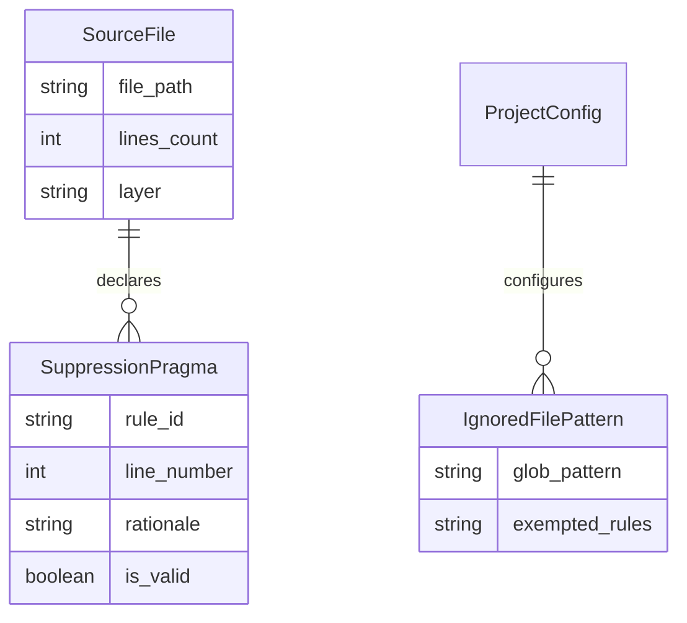

# Data Model: False-Positive Elimination & Exemption Engine

---

## 1. Entities

### 1.1. `SuppressionPragma`
Represents an inline directive bypassing a specific rule on a target line or block.

| Field | Type | Required | Description |
| :--- | :--- | :--- | :--- |
| `rule_id` | string | Yes | Target rule to ignore (e.g. `ARCH-LAYER-01`, `ALL`) |
| `line_number` | integer | Yes | 1-indexed target line number exempted from the rule |
| `rationale` | string | Yes | Mandatory human reason/justification for the exemption |
| `is_valid` | boolean | Yes | `true` if a non-empty rationale is provided |

---

### 1.2. `IgnoredFilePattern`
Represents a `.guardianignore` pattern exemption.

| Field | Type | Required | Description |
| :--- | :--- | :--- | :--- |
| `glob_pattern` | string | Yes | File or directory glob pattern (e.g. `legacy/**`, `migrations/*`) |
| `exempted_rules` | list of strings | No | Specific rule IDs to exempt, or all rules if omitted |
| `reason` | string | No | Optional documented justification |

---

## 2. Entity-Relationship Diagram (Mermaid)

