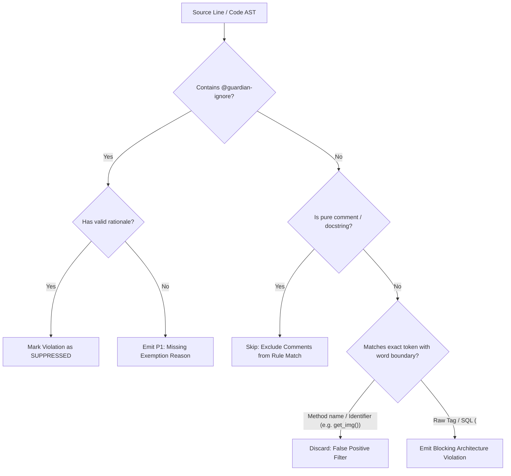

# Specification: False-Positive Elimination, Contextual AST Filtering & Inline Exemption Engine

This specification defines the architecture, algorithms, and rules for eliminating false positives ("false true" non-conformances) in the **Bend DevOps Guardian**, including syntactic word boundary fences, comment/docstring scoping, and formal inline suppression pragmas (`@guardian-ignore`).

---

## 1. Objective

Provide a robust, high-precision contextual token scanner that eliminates false positives arising from method/function names (e.g., `get_image_url()`, `select_item()`), variable identifiers, comments, and docstrings, while supporting explicit, documented inline and configuration-level suppression rules (`@guardian-ignore`, `.guardianignore`).

---

## 2. Functional Requirements

| ID | Description | Actor | Priority |
| :--- | :--- | :--- | :--- |
| **RF01** | **Syntactic Word Boundary Fencing**: Prevent identifier substrings (e.g., method `get_img_url()`, variable `select_count`) from triggering false positive matches against HTML tags (`"`, `SELECT * FROM users`) must always be detected with 100% recall. |
| **RNF03** | **High-Throughput Tokenization** | Token filtering and comment stripping must add <5ms overhead per 1,000 lines of code. |

---

## 4. Business Rules

| ID | Rule |
| :--- | :--- |
| **RN01** | **Mandatory Justification**: An inline suppression `// @guardian-ignore ARCH-LAYER-01` without a reason (e.g. `: legacy compatibility`) is treated as an invalid pragma and rejected with a `P1_WARNING`. |
| **RN02** | **Literal String Distinction**: Differentiate between markup tags (e.g., `""`) and plain identifiers (`img_path`, `div_factor`). |
| **RN03** | **Single-Line vs Block Scope**: `@guardian-ignore` applies strictly to the immediately following line, or an enclosed block marked by `@guardian-ignore-start` and `@guardian-ignore-end`. |

---

## 5. Use Scenarios

### Scenario 1: Method name contains substring of forbidden token
* **Given that** a C# Domain Model contains `public string GetImageUrl(int userId)`
* **When** the scanner analyzes the file
* **Then** the syntactic boundary fence detects `GetImageUrl` as a function identifier
* **And** does not flag it as an HTML `` tag (0 false positives).

### Scenario 2: Inline documented suppression pragma
* **Given that** an integration test helper legitimately embeds a raw SQL query `SELECT * FROM test_data`
* **And** includes `// @guardian-ignore ARCH-LAYER-02: Required for test database seeding`
* **When** the scanner processes the line
* **Then** the violation is recorded as `SUPPRESSED` with the associated rationale
* **And** does not block the quality gate.

---

## 6. Acceptance Criteria

1. Automated unit test suite verifying zero false positives on identifier names (`get_image()`, `select_box()`, `input_stream()`, `form_data()`).
2. Inline pragma parser correctly ignoring flagged lines accompanied by valid rationale.
3. `.guardianignore` file parser excluding specified paths or rules.
4. Full integration with `scripts/culture_guard.py` and `./scripts/validate.sh`.

---

## 7. UML & Architectural Diagrams (Mermaid)

### 7.1. Contextual AST & Token Filter Flowchart

---

## 8. Out of Scope

- Complete compiler semantic type resolution for dynamic un-typed languages without symbol tables.
