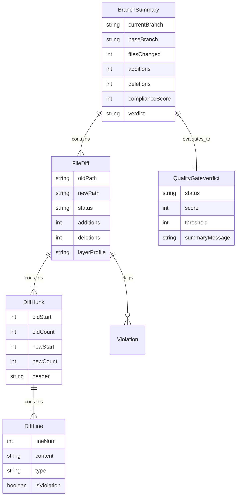

# Data Model: Live Code & Diff Auditor

This document defines the core data entities, models, and type definitions used across the **Live Code & Diff Auditor** in both TypeScript (Frontend) and Python (Backend / Adapters).

---

## 1. Entities & Types

### 1.1. `AuditScope`
Defines the boundary of the audit execution.
```typescript
type AuditScope = 'branch_analysis' | 'single_file';
```

### 1.2. `DiffLineType` & `DiffLine`
Represents an individual line in a unified diff or side-by-side comparison.
```typescript
type DiffLineType = 'addition' | 'deletion' | 'context' | 'header' | 'empty';

interface DiffLine {
  lineNum: number | null;
  content: string;
  type: DiffLineType;
  isViolation?: boolean;
  violationCode?: string;
  violationMessage?: string;
  remediation?: string;
}
```

### 1.3. `DiffHunk`
Represents a contiguous block of modifications within a file diff.
```typescript
interface DiffHunk {
  oldStart: number;
  oldCount: number;
  newStart: number;
  newCount: number;
  header: string;
  lines: DiffLine[];
}
```

### 1.4. `FileStatus` & `FileDiff`
Represents a changed file within a branch comparison.
```typescript
type FileStatus = 'modified' | 'added' | 'deleted' | 'renamed';

interface FileDiff {
  oldPath?: string;
  newPath: string;
  status: FileStatus;
  additions: number;
  deletions: number;
  changedLines: number[];
  hunks: DiffHunk[];
  violationsCount: number;
  blockingViolationsCount: number;
  layerProfile: string;
  originalCode: string;
  correctedCode: string;
}
```

### 1.5. `BranchSummary`
Aggregates the evaluation results across all files in a branch comparison.
```typescript
interface BranchSummary {
  currentBranch: string;
  baseBranch: string;
  filesChanged: number;
  additions: number;
  deletions: number;
  complianceScore: number;
  verdict: 'APPROVED' | 'BLOCKED' | 'WARNING';
  blockingViolations: number;
  warningViolations: number;
  files: FileDiff[];
}
```

### 1.6. `QualityGateVerdict`
The overall verdict emitted by the Guardian policy engine.
```typescript
interface QualityGateVerdict {
  status: 'APPROVED' | 'BLOCKED' | 'WARNING';
  score: number;
  threshold: number;
  blockingViolations: number;
  warnings: number;
  summaryMessage: string;
  evalTimestamp: string;
}
```

---

## 2. Entity-Relationship Diagram (Mermaid)


