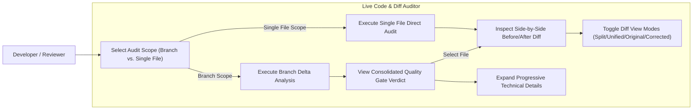
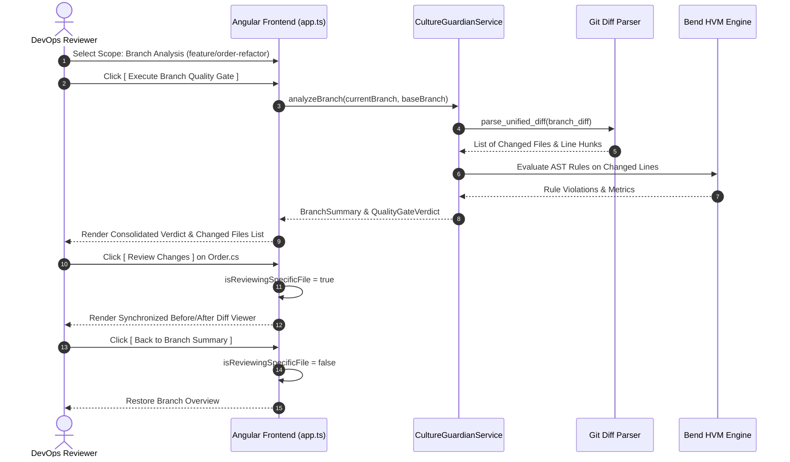

# Specification: Live Code & Diff Auditor (Branch-First & Focused File Review)

This specification defines the functional, non-functional, and business rules for the **Live Code & Diff Auditor** in **Bend DevOps Guardian**. It establishes a branch-first evaluation model, side-by-side Before/After diff auditing, progressive disclosure UX, and comprehensive Git diff delta analysis.

---

## 1. Objective

Provide an enterprise-grade, high-performance code and diff auditor that allows DevOps engineers, software architects, and developers to validate code changes against Clean Architecture and engineering standards before merging. The system prioritizes full branch analysis (`Workflow A`), provides single-file targeted review (`Workflow B`), renders synchronized Before/After visual diffs, and computes deterministic Quality Gate verdicts.

---

## 2. Functional Requirements

| ID | Description | Actor | Priority |
| :--- | :--- | :--- | :--- |
| **RF01** | **Branch-First Analysis Workflow**: Automatically discover and evaluate all modified, added, deleted, and renamed files across a feature branch delta (`feature/order-refactor → main`) without requiring premature file selection. | DevOps Engineer / CI Runner | High |
| **RF02** | **Targeted Single-File Review Workflow**: Allow direct selection and audit of a single file and architecture profile (`Domain`, `Application`, `Infrastructure`, `Presentation`) without triggering full branch analysis. | Developer / Reviewer | High |
| **RF03** | **Post-Branch File Deep-Dive**: Allow drill-down into any specific file changed in the branch analysis to inspect line-by-line Before/After diffs, rule violations, and auto-remediations. | Reviewer | High |
| **RF04** | **Side-by-Side Before/After Diff Viewer**: Render original vs. Guardian-corrected code side-by-side with synchronized line numbering, syntax highlighting, additions/deletions/context distinction, and view mode switching (`Split`, `Unified`, `Original`, `Corrected`). | Reviewer / Architect | High |
| **RF05** | **Comprehensive Git Diff Engine**: Parse unified Git diff patches (`git diff origin/main...HEAD`), supporting added files (`new file mode`), deleted files (`deleted file mode`), renamed files (`rename from/to`), and multiple hunks with exact line tracking. | Diff Engine / VCS Adapters | High |
| **RF06** | **Changed-Line Isolation**: Restrict quality gate violations strictly to modified/added lines (`+` lines), preventing false positives from preexisting unchanged context lines (` ` lines). | Core Scanner | High |
| **RF07** | **Progressive Disclosure UX**: Present an uncluttered primary interface (Scope Selector, Action CTA, Consolidated Verdict) while encapsulating secondary metrics (HVM reduction stats, token taxonomies, AST metrics) under collapsible disclosure panels. | Reviewer | Medium |
| **RF08** | **Deterministic Quality Gate Verdict**: Compute pass/fail/warn status based on configurable thresholds, blocking P0 severity violations, and aggregate compliance scoring (0–100 pts). | Policy Engine | High |

---

## 3. Non-Functional Requirements

| ID | Category | Description |
| :--- | :--- | :--- |
| **RNF01** | **Performance & Parallelism** | Branch diff extraction and AST evaluation must leverage Bend HVM parallel reduction, evaluating ≤100 changed files in <3 seconds. |
| **RNF02** | **Clarity & Cognitive Load** | Primary auditor screen must follow the 3-second comprehension rule: `SELECT SCOPE → ANALYZE → SEE RESULT → INSPECT CHANGES`. |
| **RNF03** | **Traceability & Auditing** | Every violation, rule evaluation, and diff hunk must link to its formal specification ID (`@spec RFxx`) and rule identifier. |
| **RNF04** | **Responsiveness & Usability** | UI must support desktop and mobile viewport resolutions (375px to 1920px) with fluid layouts and accessible WCAG 2.1 AA contrasts. |

---

## 4. Business Rules

| ID | Rule |
| :--- | :--- |
| **RN01** | **P0 Blocking Merges**: If any P0 blocking violation exists in changed lines (e.g. `ARCH-LAYER-01` presentation leak in domain, `CULT04` secret leak), the Quality Gate verdict MUST be `BLOCKED` (Fail), preventing branch merges. |
| **RN02** | **Empty Branch Handling**: When the target branch contains 0 changed files or identical commit hashes (`current == base`), the system MUST display a clear "No changes detected between branches" state without faking a 100% pass or crashing. |
| **RN03** | **Deleted & Added File Representations**: Added files must display `BEFORE: [File did not exist]` and `AFTER: [New File Content]`. Deleted files must display `BEFORE: [Original Content]` and `AFTER: [File deleted in branch]`. Renamed files must explicitly indicate old and new paths. |
| **RN04** | **Non-Destructive Post-Analysis Navigation**: Exiting a single file review must return the user directly to the branch audit summary with all previous analysis metrics preserved. |

---

## 5. Use Scenarios

### Scenario 1: Full Branch Analysis (Primary Workflow A)
* **Given that** the user selects the "Branch Analysis" scope (`feature/order-refactor → main`)
* **When** the user clicks `[ Execute Branch Quality Gate ]`
* **Then** the system parses the Git diff delta across all 4 changed files
* **And** evaluates architecture rules across Domain, Application, and Views
* **And** displays the consolidated Quality Gate verdict card (e.g., `82/100 - BLOCKED: 1 P0 Violation`)
* **And** lists each changed file with its individual status, additions/deletions count, and violation badges.

### Scenario 2: Post-Branch File Review & Before/After Inspection
* **Given that** branch analysis is completed with 1 blocking violation on `src/Domain/Entities/Order.cs`
* **When** the reviewer clicks `[ Review Changes ]` on that file
* **Then** the interface opens the Before/After side-by-side diff viewer
* **And** highlights the `ARCH-LAYER-01` violation on line 12 of the original code
* **And** displays the Guardian-corrected code removing the Presentation markup
* **And** clicking `[ Back to Branch Summary ]` restores the full branch overview.

### Scenario 3: Targeted Single File Review (Workflow B)
* **Given that** the user selects "Single File Review" mode
* **When** the user selects `src/Application/Services/OrderService.cs` and clicks `[ Audit Single File ]`
* **Then** the auditor evaluates only that file against the Application Layer profile
* **And** presents immediate side-by-side Before/After comparison and compliance score.

### Scenario 4: Empty Branch Edge Case
* **Given that** `feature/order-refactor` is identical to `main` (0 diff hunks)
* **When** the user executes branch analysis
* **Then** the system displays "No changes to analyze" with instructions to check branch selection.

---

## 6. Acceptance Criteria

1. **Clean Scope Separation**: Initial screen displays only Scope Switcher (`Branch Changes` vs. `Single File`) without premature file dropdowns.
2. **Side-by-Side Diff Engine**: Before/After panels display synchronized line alignment, additions (`+`), deletions (`-`), and rule remediation explanations.
3. **Four View Modes**: User can toggle between `Split (Side-by-Side)`, `Unified`, `Original Only`, and `Corrected Only`.
4. **Git Delta Support**: Diff parser accurately processes unified diffs with added, deleted, modified, and renamed files.
5. **100% Test Coverage**: All unit, integration, and E2E Playwright tests pass without regressions.

---

## 7. UML & Architectural Diagrams (Mermaid)

### 7.1. Use Case Diagram

### 7.2. Sequence Diagram: Branch Analysis to Post-Review Flow

---

## 8. Out of Scope

- Direct Git remote push/commit capabilities from within the browser (Auditor is read/validate-only).
- Arbitrary multi-branch merge conflict resolution.
