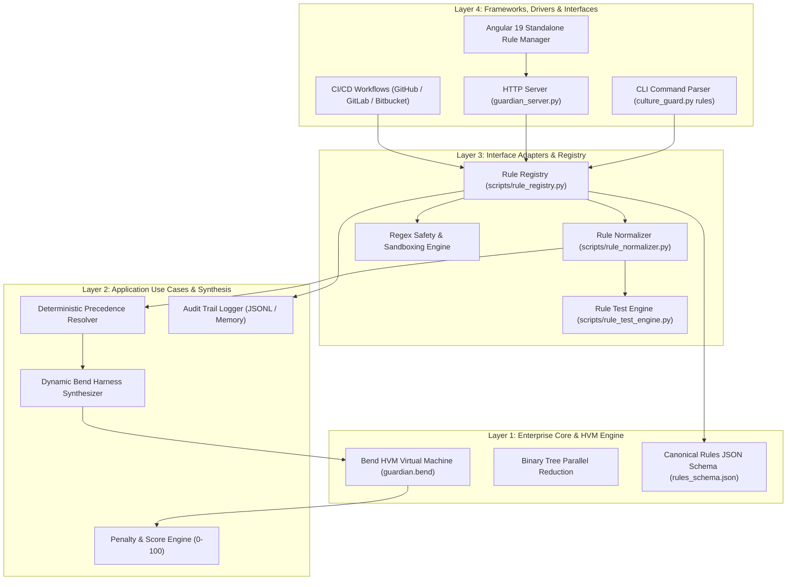
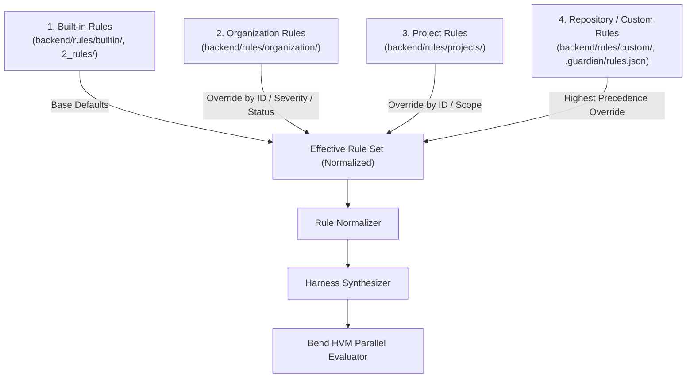
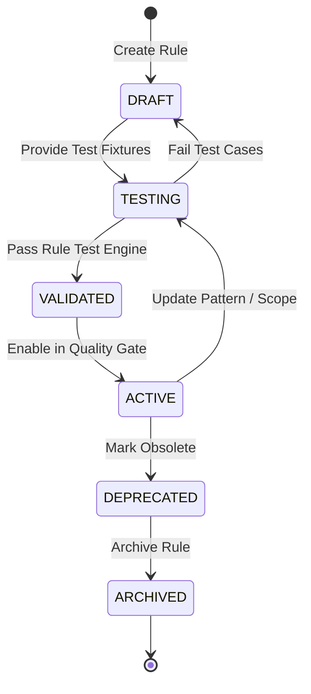

# Architecture Specification: Extensible Rule Engine

**Spec ID**: `SPEC-006-ARCH`  
**Parent**: `SPEC-006`  
**Layer**: Clean Architecture Concentric Layers  

---

## 1. Concentric Layer Separation

The Extensible Rule Management engine follows the existing 4 concentric layers:

---

## 2. Rule Resolution & Precedence Architecture

The Rule Registry resolves the **Effective Rule Set** using deterministic bottom-up precedence:

### Precedence Resolution Algorithm
1. Base definitions are loaded from **Built-in** manifests (`backend/rules/2_rules/` and `backend/rules/builtin/`).
2. **Organization-level** rules augment or override Built-in rules by exact `id` match.
3. **Project-level** rules augment or override Organization rules.
4. **Repository/Custom-level** rules possess highest precedence, allowing local teams to adjust severity, regex patterns, or disabled status.

---

## 3. Rule Lifecycle State Machine

### Lifecycle State Policies:
- **DRAFT**: Rule under creation or editing. Excluded from CI/CD Quality Gate.
- **TESTING**: Rule with attached test fixtures. Can run within the isolated Rule Test Engine.
- **VALIDATED**: Schema-valid and passed 100% of test fixtures. Eligible for activation.
- **ACTIVE**: Fully active in the CI/CD Quality Gate, CLI audits, and dashboard live diff inspections.
- **DEPRECATED**: Emits advisory warning without failing the Quality Gate build.
- **ARCHIVED**: Stored for audit trail / history; never evaluated during audits.
