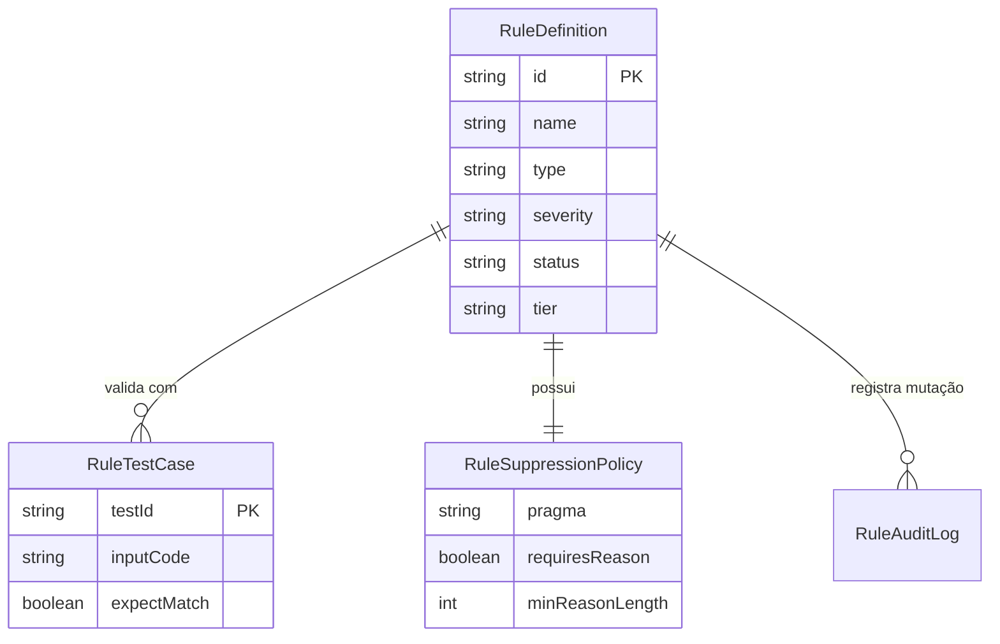

# Modelo de Dados: Extensible Rule Management

---

## 1. Entidades

### `RuleDefinition`
| Campo | Tipo | Nulável | Descrição |
| :--- | :--- | :--- | :--- |
| `id` | string | Não | Identificador único (ex: `SEC-001`, `CUSTOM-01`) |
| `name` | string | Não | Nome legível da regra |
| `type` | enum (`pattern`, `naming`, `dependency`, `architecture`, `file_folder`, `ast`) | Não | Categoria técnica de detecção |
| `severity` | enum (`P0`, `P1`, `P2`, `P3`, `INFO`) | Não | Nível de criticidade no Quality Gate |
| `status` | enum (`DRAFT`, `TESTING`, `VALIDATED`, `ACTIVE`, `DEPRECATED`, `ARCHIVED`) | Não | Estado no ciclo de vida |
| `tier` | enum (`builtin`, `organization`, `project`, `repository`) | Não | Nível hierárquico de precedência |
| `condition` | object | Não | Parâmetros de detecção léxica/estrutural |
| `suppression` | object | Sim | Política de pragma (`@guardian-ignore`) |
| `tests` | list[object] | Sim | Suíte de testes unitários da regra |

---

## 2. Diagrama ER

