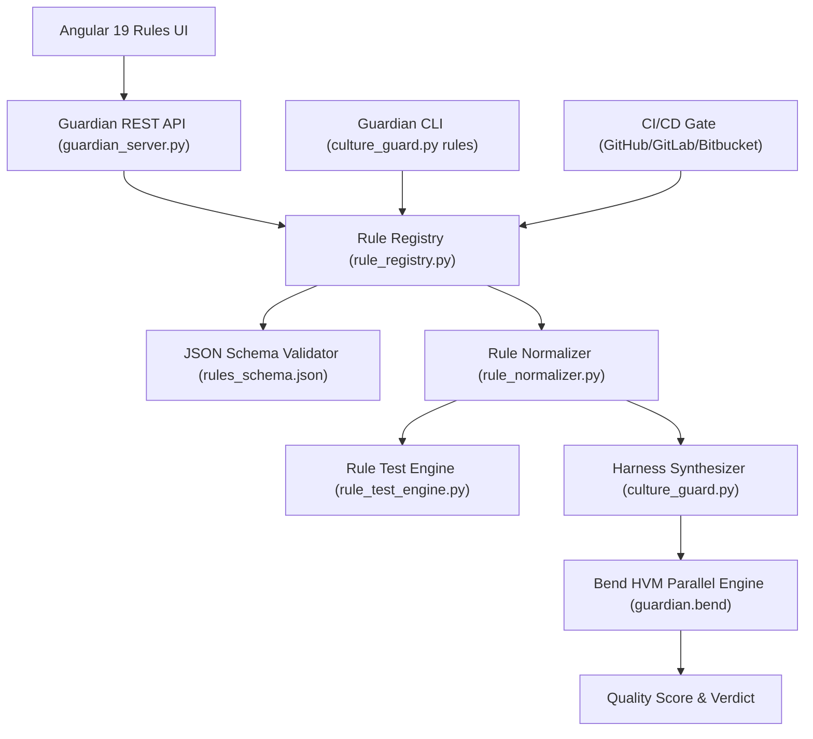

# Specification: Extensible Rule Management & Custom Rule Engine

**Spec ID**: `SPEC-006`  
**Status**: `APPROVED`  
**Authors**: Bend DevOps Guardian Engineering Team  
**Date**: 2026-09-25  

---

## 1. Executive Summary

This specification defines the complete architecture, data models, APIs, CLI commands, and UI components for **Extensible Rule Management & Custom Rule Engine** in **Bend DevOps Guardian**.

Prior to this specification, the Guardian operated on fixed declarative manifests in `backend/rules/`. Spec-006 transforms the Guardian into a fully extensible governance platform capable of creating, editing, cloning, testing, validating, activating, importing, exporting, and versioning rules across multiple scope tiers (Built-in, Organization, Project, and Repository) while maintaining a purely functional, agnostic execution kernel in the Bend/HVM virtual machine.

---

## 2. Goals & Key Requirements

1. **Rule Extensibility**: Provide end-to-end CRUD, lifecycle management, cloning, and versioning of rules.
2. **Rule Typology**: Support Pattern, Naming, Dependency, Architecture, File/Folder, AST, and Language-Specific rule types.
3. **Severity Standardization**: Standardize on `P0` (Blocking Blocker), `P1` (Major Warning), `P2` (Minor Invariant), `P3` (Nitpick), and `INFO` (Informational Note) with backward-compatible mappings.
4. **Deterministic Precedence**: Hierarchical rule resolution order:
   $$\text{Built-in} \longrightarrow \text{Organization} \longrightarrow \text{Project} \longrightarrow \text{Repository / Custom}$$
5. **Rule Lifecycle**: State machine governing transitions:
   $$\text{DRAFT} \longrightarrow \text{TESTING} \longrightarrow \text{VALIDATED} \longrightarrow \text{ACTIVE} \longrightarrow \text{DEPRECATED} \longrightarrow \text{ARCHIVED}$$
6. **Isolated Rule Testing**: Unit test engine allowing author-driven verification of rules against valid, invalid, and suppressed code inputs before activation.
7. **Security & ReDoS Protection**: Declarative sandboxing without arbitrary code execution; timeout-bound safe regex evaluation preventing catastrophic backtracking.
8. **Bend HVM Agnostic Execution**: Bend HVM engine receives normalized canonical rule expressions without hardcoding specific rule implementations in Bend source files.
9. **Omnichannel Interfaces**: Full functionality accessible via Angular 19 Web Dashboard, Guardian REST API, and Guardian CLI.
10. **CI/CD Quality Gate & Supression**: Full preservation of PR commenting, SARIF export, and inline pragma exemptions (`@guardian-ignore RULE_ID: justification >= 8 chars`).

---

## 3. Architecture Overview

---

## 4. Acceptance Criteria

- [x] All 7 rule types can be created, stored, retrieved, updated, and deleted.
- [x] Validation against `backend/rules/rules_schema.json` blocks invalid rule configurations.
- [x] Rule test engine successfully verifies positive, negative, and `@guardian-ignore` cases.
- [x] Precedence order resolves overrides without ambiguity.
- [x] Bend HVM executes parallel reduction on dynamically synthesized harnesses containing custom rules.
- [x] REST API provides complete CRUD, testing, cloning, import, and export endpoints.
- [x] CLI provides full `guardian rules` command set with multi-dimensional filtering.
- [x] Angular Dashboard renders Rule Manager with search, filters, details, wizard, and test console.
- [x] Zero regressions on existing test suites (`scripts/validate.sh`).
