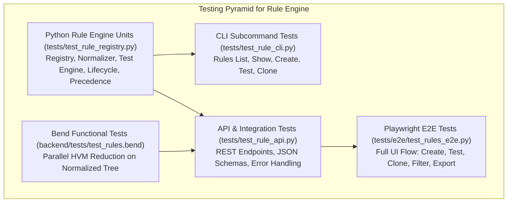

# Testing & Verification Specification: Rule Engine

**Spec ID**: `SPEC-006-TEST`  
**Parent**: `SPEC-006`  

---

## 1. Testing Strategy

The test suite ensures 100% test coverage across all layers of the Extensible Rule Management engine:

---

## 2. Test Cases Matrix

1. **Rule Registry Tests**:
   - `test_register_valid_rule`
   - `test_register_duplicate_rejection`
   - `test_rule_precedence_resolution` (Builtin < Org < Project < Custom)
   - `test_rule_lifecycle_transitions` (DRAFT -> TESTING -> VALIDATED -> ACTIVE)
   - `test_rule_cloning`
   - `test_rule_deletion_and_archive`
   - `test_rule_import_export`
   - `test_audit_trail_generation`
2. **Rule Test Engine & Safety Tests**:
   - `test_pattern_rule_positive_and_negative_matching`
   - `test_naming_rule_casing_conformance`
   - `test_dependency_rule_boundary_detection`
   - `test_file_folder_rule_path_scope`
   - `test_inline_pragma_suppression` (`@guardian-ignore <ID>: <reason>`)
   - `test_invalid_short_pragma_reason_rejected` (<8 chars)
   - `test_regex_catastrophic_backtracking_safety`
3. **Bend HVM Parallel Reduction Tests**:
   - `test_custom_rule_evaluation_in_bend`
   - `test_severity_penalty_aggregation`
   - `test_parallel_tree_reduction_integrity`
4. **Angular & E2E Tests**:
   - Rule Manager table rendering and search query filtering
   - Create Rule wizard validation & persistence
   - Interactive Rule Tester with real-time match highlighting
   - Clone and export modals
