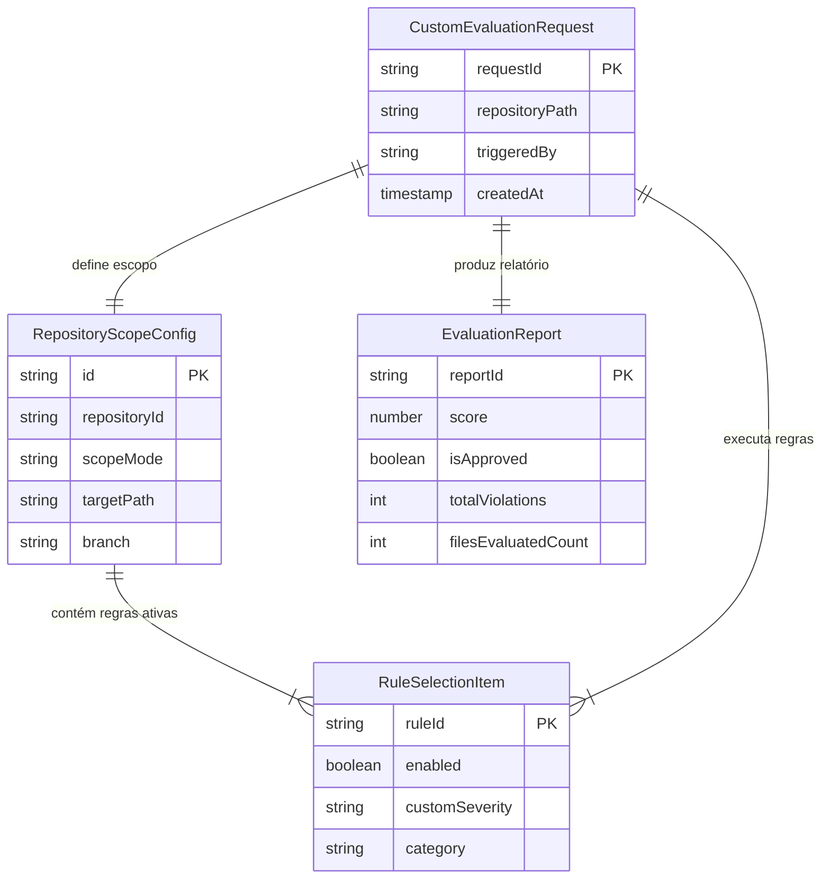

# Modelo de Dados: Escopo e Composição de Regras Arquiteturais

Este documento modela as estruturas de dados para configuração de escopos de análise, seleção modular de regras complementares e relatórios de avaliação no **Bend DevOps Guardian**.

---

## 1. Entidades

### `RepositoryScopeConfig`
Configuração do escopo de análise delimitado pelo usuário para um repositório.

| Campo | Tipo | Nulável | Padrão | Descrição |
| :--- | :--- | :--- | :--- | :--- |
| `id` | string (UUID) | Não | auto | Identificador único da configuração |
| `repositoryId` | string | Não | - | ID ou caminho do repositório associado |
| `scopeMode` | enum (`full_branch`, `working_tree_diff`, `subdirectory`, `single_file`) | Não | `full_branch` | Nível do escopo de inspeção |
| `targetPath` | string | Sim | `null` | Caminho do subdiretório ou arquivo alvo quando aplicável |
| `branch` | string | Não | `main` | Branch selecionada |
| `includePatterns` | list[string] | Não | `["*"]` | Padrões glob de arquivos incluídos |
| `excludePatterns` | list[string] | Não | `["node_modules/**", ".git/**"]` | Padrões glob de arquivos ignorados |

---

### `RuleSelectionItem`
Item de regra individual selecionado e customizado pelo usuário.

| Campo | Tipo | Nulável | Padrão | Descrição |
| :--- | :--- | :--- | :--- | :--- |
| `ruleId` | string | Não | - | Identificador único da regra (ex: `ARCH-LAYER-01`, `SEC-001`) |
| `enabled` | boolean | Não | `true` | Se a regra está ativa na auditoria |
| `customSeverity` | enum (`P0_BLOCKING`, `P1_WARNING`, `P2_INFO`) | Sim | `null` | Sobrescrita de severidade definida pelo usuário |
| `category` | string | Não | `architecture` | Categoria da regra (camada, segurança, estilo, etc.) |

---

### `CustomEvaluationRequest`
Payload enviado para disparo da auditoria com escopo e regras parametrizadas.

| Campo | Tipo | Nulável | Padrão | Descrição |
| :--- | :--- | :--- | :--- | :--- |
| `repositoryPath` | string | Não | - | Caminho local ou URI remota do repositório |
| `scope` | `RepositoryScopeConfig` | Não | - | Definição do escopo de arquivos |
| `rules` | list[`RuleSelectionItem`] | Não | - | Conjunto de regras ativas e complementares |
| `triggeredBy` | string | Não | `user` | Origem do disparo (`user`, `cli`, `webhook`) |

---

## 2. Relacionamentos

| Entidade A | Cardinalidade | Entidade B | Chave Estrangeira |
| :--- | :--- | :--- | :--- |
| `RepositoryScopeConfig` | 1:N | `RuleSelectionItem` | `scope_id` |
| `CustomEvaluationRequest` | 1:1 | `RepositoryScopeConfig` | `scope_id` |
| `CustomEvaluationRequest` | 1:N | `RuleSelectionItem` | `request_id` |

---

## 3. Diagrama Entidade-Relacionamento (Mermaid)

