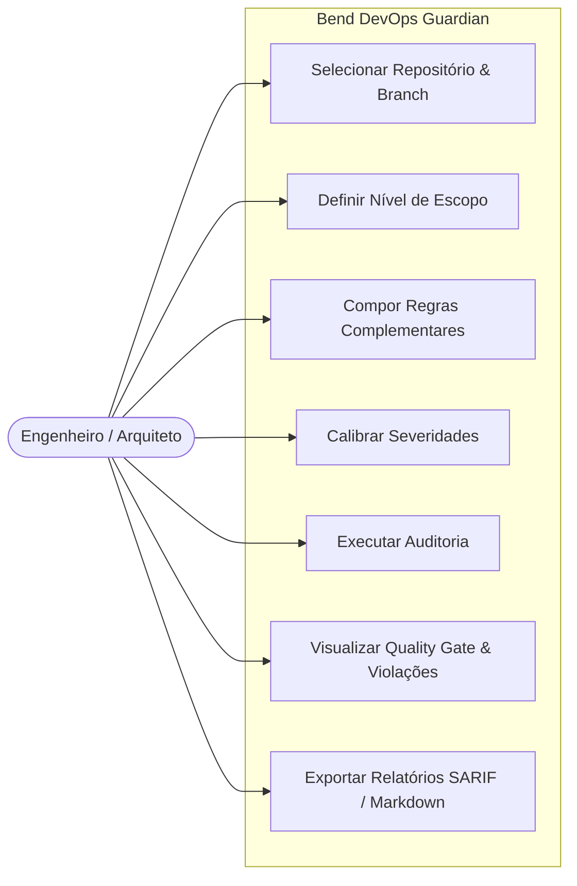
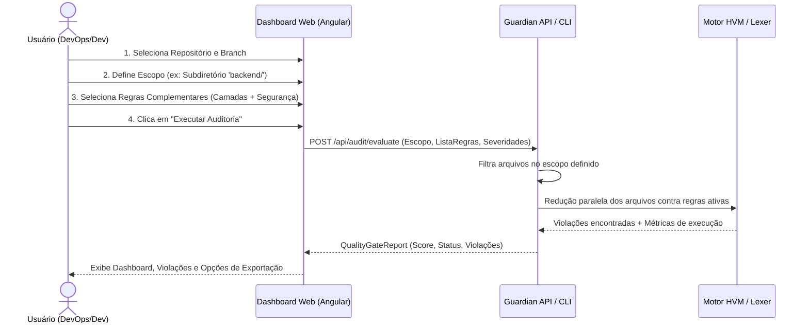

# Especificação: Escopo e Composição de Regras Arquiteturais Orientadas ao Usuário

Esta especificação define o mecanismo de **parametrização de escopo** e **composição modular de regras arquiteturais** pelo usuário no **Bend DevOps Guardian**. Cada repositório (seja local no sistema de arquivos ou remoto no GitHub) possui necessidades arquiteturais distintas. O sistema permite que o usuário componha regras complementares (camadas, segurança, convenções e regras customizadas) e defina a amplitude de varredura (Full Branch, Working Tree/Diff, Subdiretório ou Arquivo Único), garantindo controle total sobre a decisão de qualidade e aprovação no Quality Gate.

---

## 1. Objetivo

Permitir que o usuário, atuando como orquestrador do Quality Gate, selecione qualquer repositório (local ou remoto), delimite o escopo exato da inspeção (branch, diff, subdiretório ou arquivo) e componha ativamente o conjunto de regras arquiteturais complementares a serem avaliadas pelo motor de análise, gerando relatórios precisos de conformidade.

---

## 2. Requisitos Funcionais

| ID | Descrição | Ator | Prioridade |
| :--- | :--- | :--- | :--- |
| **RF01** | **Seleção de Origem e Repositório**: O usuário pode selecionar a origem do repositório entre sistema de arquivos local ou conta GitHub, escolhendo a branch ou commit alvo. | Engenheiro / Arquiteto | Alta |
| **RF02** | **Parametrização de Escopo de Inspeção**: O usuário pode escolher entre 4 níveis de escopo: `full_branch` (todo o repositório), `working_tree_diff` (apenas alterações recentes/diff), `subdirectory` (pasta ou módulo específico) e `single_file` (arquivo individual). | Engenheiro / Arquiteto | Alta |
| **RF03** | **Composição Modular de Regras Complementares**: O usuário pode ativar, desativar e combinar regras de múltiplos domínios (fronteiras de camada, segurança, taxonomia de nomes, sanitização) para compor a política de validação do projeto. | Arquiteto / Tech Lead | Alta |
| **RF04** | **Calibração de Severidade das Regras**: O usuário pode ajustar a severidade de cada regra selecionada (`P0_BLOCKING`, `P1_WARNING`, `P2_INFO`) para refletir a política do projeto. | Arquiteto / Tech Lead | Média |
| **RF05** | **Execução Restrita ao Escopo e Regras Selecionadas**: O motor de auditoria deve processar estritamente os arquivos contidos no escopo parametrizado contra as regras ativadas pelo usuário. | Sistema | Alta |
| **RF06** | **Persistência de Políticas por Repositório**: O sistema deve permitir salvar as preferências de escopo e conjunto de regras ativas associadas ao repositório para execuções futuras. | Engenheiro / Arquiteto | Média |
| **RF07** | **Relatório de Conformidade Customizado**: O sistema deve exibir pontuação, violações discriminadas por regra ativa e status do Quality Gate (PASS/BLOCKED), permitindo exportação nos formatos SARIF, GitLab e Markdown. | Engenheiro / Arquiteto | Alta |

---

## 3. Requisitos Não-Funcionais

| ID | Categoria | Descrição |
| :--- | :--- | :--- |
| **RNF01** | **Desempenho** | A filtragem de arquivos pelo escopo e o carregamento do conjunto de regras ativas devem ser executados em menos de 100ms antes do envio ao motor de análise. |
| **RNF02** | **Determinismo** | A avaliação para o mesmo par (escopo, conjunto de regras) deve produzir exatamente os mesmos resultados e pontuação. |
| **RNF03** | **Usabilidade** | A interface web deve fornecer feedback visual instantâneo do número de arquivos no escopo e total de regras complementares ativas. |
| **RNF04** | **Compatibilidade** | O payload de execução deve ser compatível com execuções interativas via Dashboard e autônomas via CLI (`scripts/culture_guard.py`). |

---

## 4. Regras de Negócio

| ID | Regra |
| :--- | :--- |
| **RN01** | **Autonomia do Usuário**: Nenhuma regra é compulsória sem a ativação explícita ou padrão definida pelo usuário para o repositório. |
| **RN02** | **Interseção de Regras Complementares**: Regras de diferentes categorias atuam de forma aditiva: uma violação em qualquer regra `P0_BLOCKING` selecionada altera o status do Quality Gate para `BLOCKED`. |
| **RN03** | **Isolamento de Escopo**: Arquivos fora do escopo selecionado não devem ser lidos nem penalizados, mesmo que contenham violações de regras ativas. |
| **RN04** | **Validação de Escopo Vazio**: Se o escopo selecionado (ex: diff vazio ou diretório inexistente) não contiver arquivos elegíveis, o sistema deve emitir um aviso informativo sem falhar a execução. |
| **RN05** | **Regras Customizadas e Herança**: Regras customizadas criadas pelo usuário herdam o mesmo ciclo de vida e podem ser combinadas livremente com regras embutidas (*built-in*). |

---

## 5. Cenários de Uso

### Cenário 1: Auditoria Focada no Pull Request Atual (Diff Mode)
* **Dado que** o usuário conectou um repositório local com alterações não comitadas
* **Quando** seleciona o escopo `working_tree_diff` e ativa as regras `ARCH-LAYER-01` (camadas) e `SEC-001` (segredos)
* **Então** o sistema audita apenas as linhas adicionadas/modificadas no diff
* **E** emite o relatório de Quality Gate considerando apenas essas duas regras ativas.

### Cenário 2: Validação Completa de Módulo Backend (Subdiretório)
* **Dado que** o projeto é um monorepo com `frontend/` e `backend/`
* **Quando** o usuário define o escopo como `subdirectory` com caminho `backend/` e ativa o conjunto completo de regras de Clean Architecture
* **Então** o sistema varre todos os arquivos dentro de `backend/` ignorando o `frontend/`
* **E** calcula o score arquitetural exclusivamente para o módulo backend.

---

## 6. Critérios de Aceitação

1. O usuário consegue alternar o escopo entre `full_branch`, `working_tree_diff`, `subdirectory` e `single_file` visualmente.
2. A listagem de regras permite selecionar/deselecionar individualmente ou por categorias complementares.
3. A execução do motor avalia unicamente os arquivos no escopo parametrizado.
4. Qualquer violação de regra `P0` ativa bloqueia o Quality Gate (`PASS = False`).
5. A exportação SARIF/GitLab reflete apenas as regras e escopos escolhidos na sessão.

---

## 7. Diagramas UML (Mermaid)

### 7.1. Diagrama de Casos de Uso

### 7.2. Diagrama de Sequência

---

## 8. Fora de Escopo

- Modificação automática de código sem aprovação do usuário (auto-refactor invasivo).
- Bloqueio direto de permissão de escrita no servidor git (o sistema atua como gate de verificação, não gerenciador de permissões IAM).
