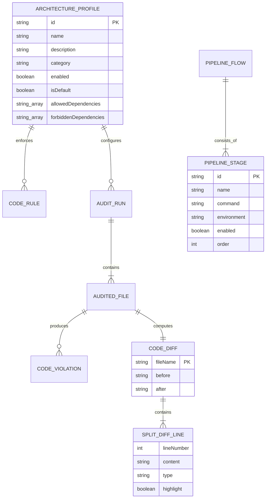

# Modelo de Dados: Pipeline Flow, Architecture Profiles, Split Diff & Coverage

Este documento detalha os modelos de dados, interfaces e estruturas de persistência que sustentam os recursos de pipeline, perfis arquiteturais, split diffs e cobertura de testes.

---

## 1. Entidades e Modelos

### `PipelineStageConfig`
Representa um estágio configurável no fluxo de execução da pipeline.

| Campo | Tipo | Nulável | Descrição |
|---|---|---|---|
| `id` | `string` | Não | Identificador único do estágio (ex: `stage-build`, `stage-lint`) |
| `name` | `string` | Não | Nome legível do estágio |
| `description` | `string` | Não | Resumo do propósito e responsabilidade da etapa |
| `command` | `string` | Não | Comando executado no pipeline (CLI/Bash) |
| `environment` | `'local' \| 'cloud' \| 'both'` | Não | Escopo de execução do estágio |
| `enabled` | `boolean` | Não | Se o estágio está ativo ou inativo |
| `order` | `number` | Não | Posição sequencial no fluxo |

---

### `ArchitectureProfile`
Representa um perfil arquitetural contendo restrições de camadas, regras de conformidade e status de ativação.

| Campo | Tipo | Nulável | Descrição |
|---|---|---|---|
| `id` | `string` | Não | Identificador único (ex: `profile_clean_arch`, `profile_custom_1`) |
| `name` | `string` | Não | Nome do perfil arquitetural |
| `description` | `string` | Não | Descrição detalhada dos padrões e fronteiras aplicados |
| `category` | `string` | Não | Categoria (ex: `Layered Architecture`, `Microservices`) |
| `enabled` | `boolean` | Não | Flag de status (Ativo / Inativo) |
| `isDefault` | `boolean` | Sim | Indica se é o perfil padrão da organização |
| `allowedDependencies` | `string[]` | Não | Lista de padrões de importação permitidos |
| `forbiddenDependencies` | `string[]` | Não | Lista de padrões de importação expressamente proibidos |
| `ruleIds` | `string[]` | Não | Identificadores de regras associadas ao perfil |

---

### `SplitDiffLine`
Representa uma linha alinhada para renderização no visualizador Before/After lado a lado.

| Campo | Tipo | Nulável | Descrição |
|---|---|---|---|
| `lineNumber` | `number` | Sim | Número da linha no arquivo |
| `content` | `string` | Não | Conteúdo textual da linha de código |
| `type` | `'unchanged' \| 'added' \| 'removed' \| 'empty'` | Não | Tipo de modificação da linha |
| `highlight` | `boolean` | Sim | Flag indicando destaque por violação arquitetural |

---

### `CodeDiff`
Agrega o resultado comparativo para renderização de diff unificado, split e correções automatizadas.

| Campo | Tipo | Nulável | Descrição |
|---|---|---|---|
| `fileName` | `string` | Não | Caminho do arquivo analisado |
| `before` | `string` | Não | Código original |
| `after` | `string` | Não | Código corrigido pelo Guardian |
| `lines` | `DiffLine[]` | Não | Linhas para visualização unificada |
| `splitBefore` | `SplitDiffLine[]` | Não | Linhas da coluna esquerda (Original) |
| `splitAfter` | `SplitDiffLine[]` | Não | Linhas da coluna direita (Guardian Corrected) |
| `explanations` | `DiffExplanation[]` | Não | Justificativas e remediações recomendadas |

---

## 2. Diagrama Entidade-Relacionamento (Mermaid ER)

