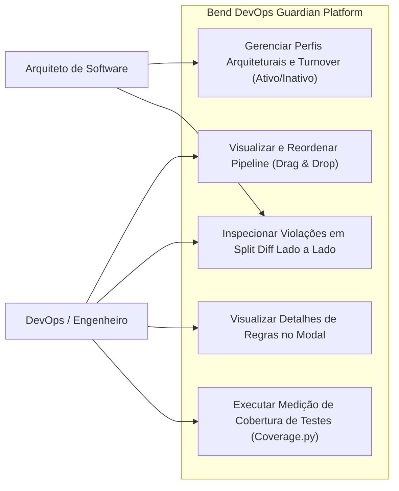
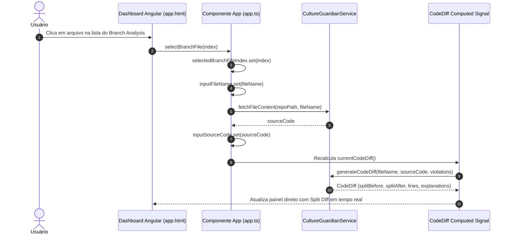
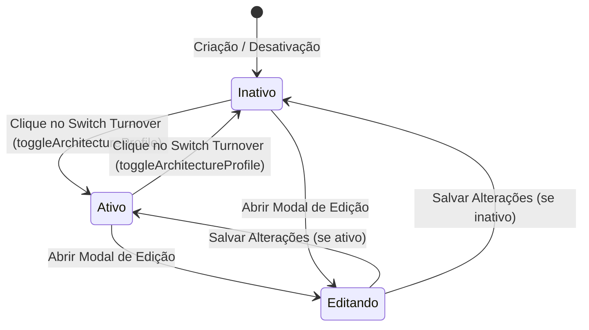

# Especificação: Pipeline Flow Visualizer, Architecture Profile Management, Side-by-Side Split Diff & Coverage Integration

Esta especificação define o conjunto avançado de recursos interativos da plataforma **Bend DevOps Guardian**, englobando o editor visual de fluxo de pipeline com Drag & Drop, o gerenciamento e turnover de Perfis Arquiteturais (Ativo/Inativo), modal de detalhes de regras, a inspeção lado a lado em Split View para resultados de auditoria de branch, rolagem independente de conteúdo central e integração oficial com Coverage.py 7.16.x para governança de qualidade de código.

---

## 1. Objetivo

Capacitar engenheiros de software, DevOps e arquitetos a configurar e auditar pipelines e padrões arquiteturais com **baixa carga cognitiva**, manipulando visualmente estágios de CI/CD, gerenciando perfis de conformidade em um clique, inspecionando código e correções recomendadas em Split View em tempo real, e auditando a cobertura de testes em pipelines automatizados.

---

## 2. Requisitos Funcionais

| ID | Descrição | Ator | Prioridade |
|---|---|---|---|
| **RF01** | **Diagrama de Fluxo Visual de Pipeline**: Renderizar gráfico de fluxo interativo que represente as fases sequenciais do pipeline CI/CD selecionado. | Engenheiro / DevOps | Alta |
| **RF02** | **Reordenação Drag & Drop de Estágios**: Permitir reordenar as etapas do pipeline arrastando e soltando via HTML5 DnD com alças de arraste (`⠿`) e botões auxiliares de precisão (subir/descer). | Engenheiro / DevOps | Alta |
| **RF03** | **Alternador de Execução Local / Nuvem**: Permitir alternar a origem e execução do pipeline entre ambiente Local e Nuvem com interruptor direto turn on/off. | Engenheiro / DevOps | Média |
| **RF04** | **Editor de Architecture Profiles**: Modal para criar e editar perfis arquiteturais customizados, com definição de camadas, regras aplicadas, dependências permitidas e proibidas. | Arquiteto de Software | Alta |
| **RF05** | **Turnover Ativo / Inativo de Perfis**: Permitir alternar o status do perfil entre "Ativo" e "Inativo" em 1 clique (turnover switch direto). | Arquiteto / DevOps | Alta |
| **RF06** | **Modal de Detalhes de Regras**: Exibir modal detalhado ao clicar em qualquer card de regra, exibindo metadados, severidade, escopo, rationale e snippets de exemplo. | Desenvolvedor / DevOps | Média |
| **RF07** | **Visualização em Split View no Branch Analysis**: Reestruturar o *Branch Analysis Result* em 2 colunas lado a lado (resumo e lista à esquerda, inspector à direita). | Desenvolvedor / Arquiteto | Alta |
| **RF08** | **Live Split Diff Inspector**: Painel interativo à direita exibindo comparação Before / After com realce de sintaxe, badges de conformidade, alternadores (Split, Unified, Original, Corrected, Copy) e botão de tela cheia. | Desenvolvedor | Alta |
| **RF09** | **Rolagem Central Independente**: Isolar a barra de rolagem do conteúdo central em relação ao menu lateral para ergonomia e baixa carga cognitiva. | Todos | Alta |
| **RF10** | **Medição de Cobertura de Testes (Coverage.py)**: Integrar Coverage.py 7.16.x com relatório de branches no terminal e geração de artefatos HTML (`htmlcov/`). | DevOps / CI Pipeline | Alta |

---

## 3. Requisitos Não-Funcionais

| ID | Categoria | Descrição |
|---|---|---|
| **RNF01** | **Carga Cognitiva** | A interface deve apresentar organização visual clara, com disclosure progressivo, sem sobrecarregar o usuário com informações simultâneas desnecessárias. |
| **RNF02** | **Responsividade** | O layout deve se adaptar fluidamente desde monitores ultrawide (`xl:col-span-*`) até dispositivos móveis, empilhando colunas graciosamente. |
| **RNF03** | **Desempenho Reativo** | A seleção de arquivos no branch e a reordenação de pipeline devem recalcular diffs e fluxogramas em menos de 16ms utilizando Angular Signals. |
| **RNF04** | **Compatibilidade e Cobertura** | As medições de cobertura devem suportar Python 3.12+, medindo branches de decisão e exportando relatórios padrão no CI/CD. |

---

## 4. Regras de Negócio

| ID | Regra |
|---|---|
| **RN01** | Qualquer reordenação de estágios de pipeline via drag & drop ou botões deve atualizar instantaneamente a visualização do fluxo, os dados de configuração e o arquivo correspondente. |
| **RN02** | Perfis marcados como "Inativo" não podem ser selecionados para novas avaliações de código sem antes serem ativados. |
| **RN03** | No *Branch Analysis Result*, clicar em qualquer arquivo da lista ou botão de inspeção de violação deve atualizar o painel direito sem fechar o resumo geral do branch. |
| **RN04** | O Diff Inspector no modo Split deve manter sincronismo de números de linha entre o código original (lado esquerdo) e o código corrigido pelo Guardian (lado direito). |
| **RN05** | A execução do Coverage.py deve medir tanto os testes de higiene/filtros (`tests/`) quanto os adaptadores VCS (`tests/vcs/`), gerando relatório unificado. |

---

## 5. Cenários de Uso (BDD)

### Cenário 1: Reordenar estágios do pipeline via Drag & Drop
* **Dado que** o usuário está na aba "Pipelines" com a sequência de estágios carregada
* **Quando** o usuário clica e arrasta o estágio `Build & HVM Check` para antes de `Lint & AST Analysis`
* **Então** o estágio assume a nova posição com feedback visual imediato
* **E** o diagrama de fluxo visual redesenha as conexões na nova ordem.

### Cenário 2: Alternar status de Architecture Profile (Turnover Ativo/Inativo)
* **Dado que** o usuário visualiza a lista de Architecture Profiles
* **Quando** o usuário clica no botão de turnover do perfil "Microservices Boundary Guard"
* **Então** o status do perfil muda imediatamente de "Ativo" para "Inativo" (ou vice-versa)
* **E** o contador de perfis ativos no cabeçalho é atualizado em tempo real.

### Cenário 3: Inspecionar diff lado a lado no Branch Analysis
* **Dado que** uma análise de branch foi executada com arquivos contendo violações
* **Quando** o usuário clica no arquivo `OrderInvoice.cs` na lista de arquivos alterados à esquerda
* **Então** o painel direito exibe o diff em Split View destacando as linhas com infração em vermelho e a correção do Guardian em verde
* **E** o banner superior exibe a recomendação automatizada de remediação.

---

## 6. Critérios de Aceitação

1. O fluxograma visual do pipeline renderiza nós interativos conectados por setas direcionais.
2. A reordenação por Drag & Drop funciona nativamente no navegador, sem dependências externas pesadas.
3. Perfis arquiteturais podem ser criados, editados e alternados entre Ativo e Inativo com persistência reativa.
4. Clicar no card de qualquer regra abre modal com os detalhes e snippets de conformidade da regra.
5. A tela de auditoria de branch apresenta layout em 2 colunas no desktop (resumo à esquerda, split diff à direita).
6. O comando `npm run coverage` executa a suíte de testes Python e gera `htmlcov/index.html`.
7. O script `./scripts/validate.sh` executa todas as 8 etapas com 100% de sucesso.

---

## 7. Diagramas UML (Mermaid)

### 7.1. Diagrama de Casos de Uso

### 7.2. Diagrama de Sequência — Seleção de Arquivo e Renderização do Split Diff

### 7.3. Diagrama de Estado — Turnover de Status de Perfil

---

## 8. Fora de Escopo

- Implementação de backend em Kubernetes para deploy automático de pipelines (foco na modelagem, auditoria e execução de qualidade).
- Suporte a frameworks legados fora da stack .NET, Python e TypeScript/Angular.
